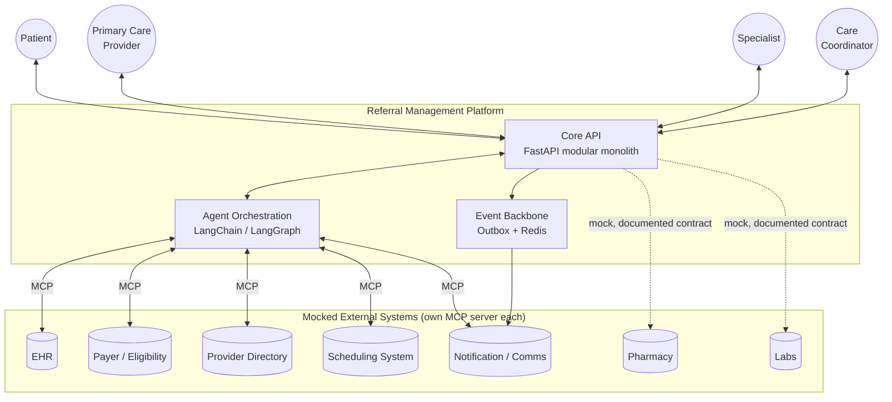
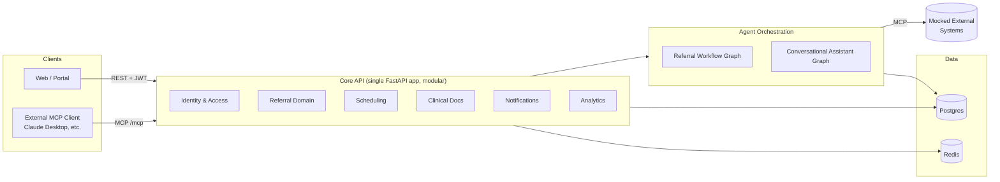
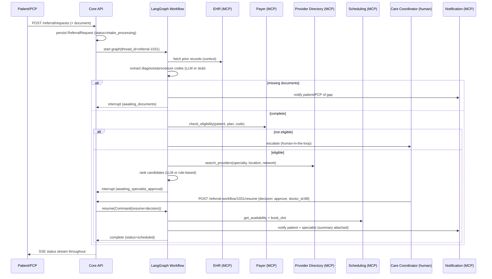

# Intelligent Care Coordination & Referral Management Platform — Agentic Build Guide

This document turns `REBUILD_GUIDE.md` (a FastAPI/JWT/SQLAlchemy fundamentals blueprint) into the
**actual capstone solution** for the Architect Academy problem statement in `problem_statemnet.txt`:
an AI-agentic referral management platform built on **FastAPI + LangChain + LangGraph + MCP +
orchestration**, that also fixes every item in `REBUILD_GUIDE.md §19 "Known Gaps"` as real,
graded features instead of leaving them as an exercise.

> **How this doc relates to `REBUILD_GUIDE.md`**: that document is still your reference for the parts
> that don't change — password hashing, the base JWT flow, Alembic setup, Docker basics, the
> `models → schemas → routes` layering convention, and plain-CRUD modules (Patients, Doctors,
> Medical Records) that the referral platform reuses almost as-is. Wherever a phase below says
> **"reuse REBUILD_GUIDE §X"**, go build that section unmodified before continuing. Everywhere else,
> this doc is the source of truth — it changes models, adds RBAC, adds the agent layer, and replaces
> the plain-CRUD framing with the actual problem statement.

---

## 0. How To Use This Guide

- Work **top to bottom**. Section 3 (Architecture & Design) is the paper deliverable — write it up
  as your actual submission doc (copy the diagrams/tables out). Section 5 (Implementation Phases) is
  the code — build phases in order, each is independently testable and Docker-runnable.
- **P0** = required for a passing minimum submission (covers all mandatory deliverables + 4 AI
  Opportunities). **P1** = stretch, do it if time allows, clearly called out per phase.
- Every phase names which **Known Gap** (REBUILD_GUIDE §19) and/or which **AI Opportunity**
  (problem statement) it resolves, so you can build a traceability story for your evaluators.
- The agent layer is designed to **run with zero API keys** (deterministic rule-based fallback) so
  `docker compose up` always demonstrates full functionality during evaluation, and to **upgrade
  itself automatically** to real LLM reasoning the moment you provide `ANTHROPIC_API_KEY` (or
  `OPENAI_API_KEY`) in `.env`. This is a deliberate design decision — see ADR-006.

---

## 1. Deliverables Traceability Matrix

| Problem statement ask | Where it's satisfied |
|---|---|
| Business capability map | §3.1 |
| Key NFRs | §3.2 |
| ADRs incl. REST vs events, orchestration vs choreography, stateful vs stateless | §3.3 |
| Healthcare context diagram | §3.4 |
| HLD, domain decomposition, stateful vs stateless services | §3.5 |
| API specs w/ sample req/resp (Referral, Eligibility, Provider search & schedule, Notification & Clinical Docs) | §3.6 |
| Sequence diagram for referral workflow | §3.7 |
| Event catalogue & event flow | §3.8 |
| Deployment view (K8s) — optional | Appendix §10.1 |
| Security architecture — optional | Appendix §10.2 |
| AI Copilot / agent integration design — optional | folded into §3.5/§5 Phase 6 (not optional here — it's the core of this build) |
| Multi-Agent Workflow (LangChain/LangGraph + MCP) | Phase 6 |
| Document Processing & Reasoning | Phase 7 |
| Conversational AI Assistant | Phase 9 |
| Testing evidence (functional/unit/integration) | Phase 12 |
| Core referral workflow (submission → eligibility → recommendation → scheduling → notification) | Phases 4, 6, 8 |
| Any 4 AI Opportunities | §7 coverage matrix — 5 implemented P0, 2 as P1 stretch |
| External systems mocked with documented contracts | Phase 3 |
| Dockerized deployment, single `docker compose up` | Phase 13 |
| End-to-end orchestration, provider/payer/scheduling integration, real-time status, analytics | Phases 5, 6, 11 |
| Governance, security, auditability, privacy, human-in-the-loop | Phase 2 + threaded through Phase 6 |

---

## 2. Tech Stack (delta on top of REBUILD_GUIDE §1)

Everything in REBUILD_GUIDE §1 stays. Add:

| Concern | Choice |
|---|---|
| Agent framework | `langchain` + `langgraph` (orchestrated multi-node graph, not a free-form agent swarm) |
| LLM provider | `langchain-anthropic` (default, `claude-sonnet-5`), `langchain-openai` (swappable), custom deterministic **stub provider** when no API key is set |
| MCP client (agents → tools) | `langchain-mcp-adapters` (`MultiServerMCPClient`) |
| MCP server (already in stack) | `fastapi-mcp` — used both for the core API (as in REBUILD_GUIDE §11) **and** for every mocked external system |
| Agent state persistence | `langgraph-checkpoint-postgres` — workflow state survives process restarts, enabling human-in-the-loop pauses that can resume hours later |
| Real-time status push | `redis` (pub/sub) + FastAPI `StreamingResponse`/SSE |
| Rate limiting | `slowapi` (login) + small Redis token-bucket dependency (AI endpoints) |
| Document text extraction | `pypdf` (PDF referral letters), plain-text passthrough for `.txt` |
| Retry/backoff for LLM & MCP calls | `tenacity` |
| Structured logging | stdlib `logging` + JSON formatter (Known Gap fix, extends REBUILD_GUIDE §12) |

### `pyproject.toml` additions
```toml
dependencies = [
    # ...everything already in REBUILD_GUIDE §3...
    "langchain>=0.3.20",
    "langchain-core>=0.3.40",
    "langchain-anthropic>=0.3.10",
    "langchain-openai>=0.3.5",
    "langgraph>=0.3.5",
    "langgraph-checkpoint-postgres>=2.0.9",
    "mcp>=1.2.0",
    "langchain-mcp-adapters>=0.1.0",
    "redis>=5.2.1",
    "slowapi>=0.1.9",
    "pypdf>=5.1.0",
    "tenacity>=9.0.0",
]
```

> LangChain/LangGraph APIs move fast. Pin exact versions in `uv.lock` the day you `uv sync`, and treat
> every code sample below as "correct shape, verify against your installed version's docs" rather than
> copy-paste gospel — the same caution REBUILD_GUIDE gives for its own dependency list.

---

## 3. Architecture & Design

### 3.1 Business Capability Map

```
┌─────────────────────────── Patient & Provider Experience ───────────────────────────┐
│  Patient Engagement   │  Referral Intake & Triage  │  Conversational Assistant       │
├────────────────────────────────────────────────────────────────────────────────────┤
│                         Care Coordination Core                                       │
│  Eligibility & Benefits │ Provider Network & Matching │ Scheduling & Capacity Mgmt    │
│  Clinical Doc & Interop │ Referral Status Tracking    │ Notifications & Comms         │
├────────────────────────────────────────────────────────────────────────────────────┤
│                       AI / Agent Orchestration & Governance                          │
│  Multi-Agent Workflow │ Human-in-the-Loop Approval │ Tool/MCP Governance │ Audit      │
├────────────────────────────────────────────────────────────────────────────────────┤
│                        Platform Foundation                                           │
│  Identity & Access (RBAC) │ Consent Management │ Analytics & Reporting │ Integration │
└────────────────────────────────────────────────────────────────────────────────────┘
```

| Capability | Owning module | New in this guide? |
|---|---|---|
| Patient Engagement | `patients`, `portal` | reuse REBUILD_GUIDE §9.1 |
| Referral Intake & Triage | `referral`, `agents.nodes.intake` | extended (Phase 1, 7) |
| Conversational Assistant | `api/routes/ai/assistant.py` | new (Phase 9) |
| Eligibility & Benefits | `referral`, mocked payer system | new (Phase 3, 8) |
| Provider Network & Matching | `doctors`, `schedule`, mocked provider directory | new (Phase 1, 3, 8) |
| Scheduling & Capacity Mgmt | `schedule`, `appointments`, mocked scheduling system | new (Phase 1, 3, 8) |
| Clinical Doc & Interop | `medical_records`, `lab`, mocked EHR | reuse + extended |
| Referral Status Tracking | `events`, SSE gateway | new (Phase 5) |
| Notifications & Comms | `notification`, mocked notification system | wired up (Phase 2, 3) |
| AI/Agent Orchestration & Governance | `agents/` | new (Phase 6) |
| Human-in-the-Loop Approval | `agents/` interrupts + `api/routes/ai/referral_workflow.py` | new (Phase 6) |
| Tool/MCP Governance | `agents/mcp_clients.py`, `agents/audit.py` | new (Phase 6) |
| Audit | `audit` (was dormant `AuditLog`) | wired up (Phase 2) |
| Identity & Access (RBAC) | `role`, `api/dependencies/auth.py` | wired up (Phase 2) |
| Consent Management | `consent` (was dormant) | wired up (Phase 2) |
| Analytics & Reporting | `api/routes/analytics.py` | new (Phase 11) |

### 3.2 Key Non-Functional Requirements

| NFR | Target / Approach |
|---|---|
| Availability | Stateless API layer → horizontally scalable behind a load balancer; no in-process session state (ADR-004) |
| Latency (sync API) | CRUD reads/writes p95 < 300ms; list endpoints paginated (Known Gap fix) |
| Latency (AI-assisted steps) | Document extraction / specialist recommendation run **async** — client gets `202 Accepted` + polls or subscribes via SSE, never blocks an HTTP request on an LLM call |
| Security | JWT bearer + refresh-token rotation (Phase 2); RBAC least-privilege (Phase 2); MCP tool access scoped per agent role (Phase 6) |
| Privacy / compliance posture | Minimum-necessary data exposure to agents/tools; consent gate before any cross-boundary share (payer/specialist); PHI-pattern redaction before anything hits a log line |
| Auditability | Every mutating API call **and** every agent tool call is written to `AuditLog` with actor, action, resource, timestamp (Phase 2, 6) |
| Explainability | Every AI recommendation (specialist ranking, delay risk) is stored with the **reasons** that produced it, not just the output — shown to the human approver |
| Human oversight | Critical decisions (final specialist selection, eligibility denial handling, appointment booking) pause the workflow for a human decision by default; auto-approve is a configurable policy, not a hardcoded shortcut |
| Resilience | Agent/tool calls wrapped in `tenacity` retry+backoff; LLM outage or missing API key degrades to deterministic rule-based logic, never a 500 |
| Observability | Structured JSON logs; correlation ID (`referral_id` or `trace_id`) threaded through API → agent → MCP tool calls |
| Testability | Every LLM call goes through one seam (`get_chat_model()`) that tests replace with a fake, so agent graphs are unit-testable without network access |
| Extensibility | New specialties/payers/mock systems are config + a new MCP server, not a core-code change |

### 3.3 Architecture Decision Records

**ADR-001 — Implement as a modular monolith; design (not build) target-state microservices**
- *Context*: problem statement asks for "domain decomposition into microservices" as a design
  deliverable, but implementation is graded via `docker compose up` on what's realistically a
  few-week capstone.
- *Decision*: design the target state as bounded-context microservices (table in §3.5). Implement as
  **one FastAPI process** with those bounded contexts as separate router/model/service packages with
  no cross-imports of internals (only through a small `services/` interface layer) plus **separately
  packaged mocked external systems**. Mock systems, being stand-ins for genuinely external
  organizations (payer, EHR, provider directory), are kept as isolated FastAPI sub-applications with
  their own MCP mount, own in-memory dataset, own container command — the seam a real extraction
  would follow.
- *Trade-off*: lose independent deploys/scaling per bounded context now; gain: no distributed
  transactions, no service-mesh/observability infra to stand up, one migration history, much easier
  to demo end-to-end in a container-execution grading model. Extraction path is documented, not
  theoretical — every module already talks to others only through its router/schema boundary.

**ADR-002 — Orchestration (not choreography) for the clinical workflow; light choreography for status fan-out**
- *Context*: problem statement explicitly asks to evaluate "orchestration vs choreography."
- *Decision*: the **referral workflow itself** (intake → eligibility → recommend → schedule →
  notify) is **orchestrated** by a single LangGraph `StateGraph` that owns the sequence, retries, and
  human-in-the-loop pause points. **Status visibility / notifications / analytics** are **choreographed**
  — each workflow step writes a domain event to an outbox table; independent consumers (SSE gateway,
  notification dispatcher, analytics aggregator) react to it without the workflow knowing they exist.
- *Trade-off*: pure choreography (every step reacting to the last via events) is more decoupled but
  makes a regulated, auditable, human-in-the-loop clinical process hard to reason about and hard to
  resume correctly after a pause — you'd need a saga coordinator anyway, which is just orchestration
  with extra steps. Pure orchestration for *everything* (including notifications/analytics) would
  couple the workflow to every downstream consumer. Hybrid gets determinism where it matters
  (clinical steps) and decoupling where it doesn't (fan-out).

**ADR-003 — REST for synchronous CRUD, an internal outbox for cross-module side effects, MCP for agent↔system integration**
- *Decision*: three distinct communication styles, used for three distinct problems, not one style
  everywhere:
  1. **REST** (existing pattern from REBUILD_GUIDE §9) for direct client↔API and API↔API-module reads/writes.
  2. **Outbox + Redis pub/sub** for "X happened, who cares reacts" (notifications, SSE, analytics) —
     see §3.8.
  3. **MCP** specifically for **agent-to-system** integration (mocked EHR/payer/provider-directory/
     scheduling/notification systems, and the platform's own API-as-tools for the conversational
     assistant) — because MCP gives a uniform, introspectable, governance-friendly tool-calling
     contract across heterogeneous systems, which raw REST clients per-agent don't.
- *Trade-off*: three mechanisms is more to learn than one, but each is the right size for its job;
  forcing everything through MCP (even simple CRUD) or everything through events (even simple reads)
  would be over-engineering for this scope.

**ADR-004 — Stateless API layer; agent/workflow state externalized to Postgres**
- *Decision*: FastAPI processes hold no session state (JWT bearer, reused from REBUILD_GUIDE §6).
  LangGraph's checkpointer (`AsyncPostgresSaver`) persists workflow state per `thread_id`
  (`referral_id` for the workflow graph, `conversation_id` for the assistant graph) in Postgres, not
  in process memory. A human-in-the-loop pause can be resumed by *any* API replica, hours or days
  later, after a process restart — required for a real "pending coordinator approval" queue.
- *Trade-off*: one more Postgres-backed subsystem vs. keeping graphs in memory; in-memory would be
  simpler but breaks the moment you scale to >1 replica or restart the container mid-approval, which
  is a real scenario for a multi-day referral, not a hypothetical.

**ADR-005 — LLM provider behind a swappable factory, with a deterministic offline fallback**
- *Decision*: `app/agents/llm.py:get_chat_model(task)` is the only place that constructs an LLM
  client. It reads `settings.llm_provider`; if the required API key is absent it returns a
  `StubChatModel` that runs small deterministic rules (regex code extraction, weighted scoring for
  specialist ranking, template text for summaries) instead of failing.
- *Why*: (1) the platform must demonstrably run "all inline functionality" under `docker compose up`
  during grading even with no API key configured or network egress blocked; (2) it makes every agent
  node unit-testable without mocking a network call; (3) it cleanly documents *which* parts of the
  pipeline are "real AI" vs. "rule-based safety net" — itself a good governance story.

**ADR-006 — RBAC via the already-modeled `Role`/`Permission` tables, not a hardcoded role string**
- *Decision*: fix Known Gap "no RBAC despite Role/Permission models existing" by adding a
  `user_roles` and `role_permissions` association table and a `require_permission("referral:approve")`
  dependency that checks the DB, not an `if user.role == "admin"` string check scattered across routes.
- *Trade-off*: one extra join per protected request vs. a config-driven, auditable, UI-manageable
  permission model — worth it since RBAC is graded as a governance capability here, not a throwaway.

### 3.4 Healthcare Context Diagram



### 3.5 High-Level Design & Domain Decomposition



**Domain decomposition (target-state bounded contexts; ADR-001 implements these as modules today, extractable to services later):**

| Bounded context | Stateful / Stateless | Owns data | Talks to |
|---|---|---|---|
| Identity & Access | Stateless (JWT verified per request); refresh tokens are stored state | `users`, `roles`, `permissions`, `refresh_tokens` | everything (auth dependency) |
| Referral Domain | Stateless service; workflow state lives in LangGraph checkpointer | `referral_requests`, `referral_documents`, `referral_statuses`, `specialist_notes` | Scheduling, Clinical Docs, Agent Layer |
| Scheduling | Stateless | `doctor_availability`, `schedule_slots`, `appointments` | mocked Scheduling system |
| Clinical Docs | Stateless | `medical_records`, `lab_*` | mocked EHR/Labs |
| Notifications | Stateless (consumer of events) | `notifications` | mocked Notification system, Redis |
| Analytics | Stateless, read-model over other contexts' tables | (no owned writes) | read-only queries |
| Agent Orchestration | **Stateful** — externalized to Postgres checkpointer (ADR-004), the one context that intentionally isn't stateless | LangGraph checkpoint tables | MCP servers, Referral Domain |
| Mocked External Systems | Stateless, in-memory/seeded data | own sandboxed data | Agent Layer only, via MCP |

### 3.6 API Specifications (sample requests/responses)

**Referral APIs**

`POST /referral/requests/` — submit a referral (P0 core workflow entry point)
```json
// Request
{
  "patient_id": 42,
  "referring_doctor_id": 7,
  "specialist_id": null,
  "request_date": "2026-08-06",
  "reason": "Persistent lower back pain, suspected herniated disc, MRI attached",
  "preferred_location": "Downtown",
  "target_wait_days": 14
}
// Response 202 Accepted (async orchestration kicked off)
{
  "id": 1031,
  "status": "intake_processing",
  "workflow_thread_id": "referral-1031",
  "created_at": "2026-08-06T10:15:00Z",
  "links": {
    "status": "/referral/requests/1031",
    "stream": "/referral/requests/1031/events"
  }
}
```

`GET /referral/requests/{id}` — status visibility (pagination envelope for lists per Known Gap fix)
```json
{
  "id": 1031,
  "status": "awaiting_specialist_approval",
  "patient_id": 42,
  "referring_doctor_id": 7,
  "specialist_id": null,
  "extracted_diagnosis_codes": ["M51.26"],
  "extracted_procedure_codes": [],
  "missing_documents": [],
  "eligibility": {"verified": true, "plan": "Acme PPO Gold", "network_status": "in_network"},
  "specialist_candidates": [
    {"doctor_id": 88, "name": "Dr. Rao", "specialty": "Orthopedics", "score": 0.91, "reasons": ["in-network", "0.9mi away", "4.8 rating", "next slot in 3 days"]},
    {"doctor_id": 91, "name": "Dr. Kim", "specialty": "Orthopedics", "score": 0.83, "reasons": ["in-network", "2.1mi away", "4.6 rating", "next slot in 5 days"]}
  ],
  "created_at": "2026-08-06T10:15:00Z",
  "updated_at": "2026-08-06T10:15:42Z"
}
```

**Eligibility**

`POST /referral/requests/{id}/eligibility:verify` (internal, also callable as an MCP tool by the agent)
```json
// Request
{"insurance_policy_number": "ACME-991123", "procedure_code": "M51.26"}
// Response
{"verified": true, "network_status": "in_network", "copay_estimate_usd": 40, "prior_auth_required": false}
```

**Provider search & schedule**

`GET /doctors/search?specialty=Orthopedics&near=Downtown&insurance_plan_id=3&available_within_days=14`
```json
{
  "items": [
    {"doctor_id": 88, "name": "Dr. Rao", "specialty": "Orthopedics", "distance_mi": 0.9, "rating": 4.8, "next_available": "2026-08-09T14:00:00Z", "in_network": true}
  ],
  "total": 6, "skip": 0, "limit": 20, "next": "/doctors/search?...&skip=20"
}
```

`POST /schedule/appointments:book`
```json
// Request
{"referral_id": 1031, "doctor_id": 88, "slot_id": 4471, "patient_preference": "morning"}
// Response
{"appointment_id": 5590, "status": "confirmed", "scheduled_for": "2026-08-09T14:00:00Z"}
```

**Notification & Clinical Documents**

`POST /referral/requests/{id}/documents` (multipart upload → triggers Document Processing agent)
```json
// Response 202
{"document_id": 771, "filename": "referral_letter.pdf", "status": "queued_for_extraction"}
```

`GET /notifications?unread_only=true`
```json
{"items": [{"id": 9001, "message": "Your referral to Dr. Rao is confirmed for Aug 9, 2:00 PM.", "is_read": false, "created_at": "2026-08-06T10:16:03Z"}], "total": 1, "skip": 0, "limit": 20}
```

### 3.7 Sequence Diagram — Referral Workflow



### 3.8 Event Catalogue & Event Flow

| Event | Producer | Consumers | Payload (key fields) |
|---|---|---|---|
| `referral.submitted` | Referral API | Analytics, Audit | referral_id, patient_id, submitted_at |
| `referral.documents.missing` | Intake agent node | Notification, SSE gateway | referral_id, missing[] |
| `referral.eligibility.verified` | Eligibility agent node | Analytics, SSE gateway | referral_id, network_status |
| `referral.eligibility.denied` | Eligibility agent node | Notification, Audit, SSE gateway | referral_id, reason |
| `referral.specialist.recommended` | Specialist agent node | SSE gateway | referral_id, candidates[] |
| `referral.specialist.selected` | Human approval endpoint | Scheduling node, Audit | referral_id, doctor_id, approver |
| `referral.appointment.scheduled` | Scheduling agent node | Notification, Analytics, SSE gateway | referral_id, appointment_id, slot |
| `referral.delay.predicted` (P1) | Delay-watch node | Notification, Audit | referral_id, risk_score, reason |
| `referral.status.changed` | any node (generic) | SSE gateway | referral_id, from_status, to_status |
| `referral.completed` | Notification node | Analytics | referral_id, total_duration_hours |

**Flow**: every workflow node that changes state writes one row to an `outbox_events` table in the
**same DB transaction** as its state change (transactional outbox — no dual-write problem). A small
background task (`app/events/publisher.py`) polls unpublished rows, publishes to a Redis channel per
`referral_id`, and the SSE endpoint (`GET /referral/requests/{id}/events`) subscribes to that channel
per connected client. Analytics reads the outbox table directly (append-only log) rather than
subscribing live.

---

## 4. Project Structure Delta

Everything from REBUILD_GUIDE §2 stays. Add:

```
healthcare_capstone/
├── app/
│   ├── core/
│   │   ├── logging.py            # NEW — structured JSON logging (Known Gap fix)
│   │   └── rate_limit.py         # NEW
│   ├── models/
│   │   ├── mixins.py             # NEW — SoftDeleteMixin, TimestampMixin
│   │   ├── schedule.py           # NEW — DoctorAvailability, ScheduleSlot
│   │   ├── refresh_token.py      # NEW
│   │   ├── role.py               # EXTENDED — UserRole, RolePermission assoc tables
│   │   ├── referral.py           # EXTENDED — ReferralDocument, status machine, deleted_at
│   │   ├── patient.py            # EXTENDED — user_id FK (portal linkage)
│   │   └── doctor.py             # EXTENDED — user_id FK, insurance network M2M
│   ├── schemas/
│   │   └── common.py             # NEW — Page[T] envelope, generic Update base
│   ├── api/
│   │   ├── dependencies/
│   │   │   ├── auth.py           # EXTENDED — require_permission(), scoping helpers
│   │   │   ├── pagination.py     # NEW
│   │   │   └── rate_limit.py     # NEW
│   │   └── routes/
│   │       ├── schedule.py       # NEW
│   │       ├── audit.py          # NEW (admin, read-only)
│   │       ├── notifications.py  # NEW
│   │       ├── consent.py        # NEW
│   │       ├── analytics.py      # NEW
│   │       └── ai/
│   │           ├── referral_workflow.py   # NEW — trigger/status/resume
│   │           └── assistant.py           # NEW — conversational endpoint (SSE)
│   ├── agents/                   # NEW — the whole LangGraph app
│   │   ├── state.py
│   │   ├── llm.py
│   │   ├── mcp_clients.py
│   │   ├── audit.py
│   │   ├── prompts/
│   │   ├── nodes/
│   │   │   ├── intake.py
│   │   │   ├── eligibility.py
│   │   │   ├── specialist.py
│   │   │   ├── scheduling.py
│   │   │   ├── notify.py
│   │   │   ├── summarizer.py
│   │   │   └── delay_watch.py    # P1
│   │   ├── graph.py              # referral workflow StateGraph
│   │   └── assistant_graph.py    # conversational ReAct-style agent
│   └── events/                   # NEW
│       ├── outbox.py
│       └── publisher.py
├── mock_systems/                 # NEW — separately mounted FastAPI sub-apps
│   ├── __init__.py
│   ├── ehr_mock/main.py
│   ├── payer_mock/main.py
│   ├── provider_directory_mock/main.py
│   ├── scheduling_mock/main.py
│   └── notification_mock/main.py
├── docker-compose.yml             # EXTENDED — +redis, +mocks service
└── CAPSTONE_IMPLEMENTATION_GUIDE.md
```

---

## 5. Implementation Phases

### Phase 0 — Baseline (P0)
Build REBUILD_GUIDE §18 steps 1–11 unmodified: scaffold, config, DB layer, auth, User model,
Patients/Doctors/Appointments/Medical Records CRUD, `fastapi_mcp` mount, CORS. **Stop before writing
tests/Docker** — those get extended in later phases here rather than done twice.

**Definition of done**: `uv run uvicorn app.main:app --reload`, register+login a user, CRUD a patient,
`/docs` and `/mcp` both respond.

---

### Phase 1 — Domain Model Extensions (P0)
*Resolves Known Gap: "Role/Permission models exist but unused" (data model half); enables provider
search & scheduling deliverable.*

> **As actually built**: Phase 0 only carried over REBUILD_GUIDE §9.1–9.4 (Patients, Doctors,
> Appointments, Medical Records) — not §9.6/§10's Referral/Insurance/Role modules. So `ReferralRequest`,
> `InsurancePlan`, `Role`, and `Permission` below are built **fresh** with their final field set
> directly, not "added to" a pre-existing REBUILD_GUIDE version. Two simplifications made along the
> way: the old `ReferralStatus` lookup table + `ReferralRequest.status_id` FK from REBUILD_GUIDE §9.6
> is **dropped entirely** — the new `status` string column (driven by `ReferralWorkflowStatus`) is the
> single source of truth for workflow state, so there's no second status representation to keep in
> sync. And `InsuranceClaim`/`Payment`/`Invoice` from REBUILD_GUIDE §9.6 are **not** built — nothing in
> this guide's phases reads or writes them; only `InsurancePlan` (needed for network matching) and
> `DoctorInsuranceNetwork` are built. Add the billing-side models later if you want that as a genuine
> "known gap" exercise, same spirit as REBUILD_GUIDE §10's bonus models.

New models:

```python
# app/models/mixins.py
from sqlalchemy import Column, DateTime
from sqlalchemy.sql import func

class SoftDeleteMixin:
    deleted_at = Column(DateTime(timezone=True), nullable=True)
```

```python
# app/models/schedule.py
from sqlalchemy import Column, Integer, String, DateTime, ForeignKey, Boolean
from sqlalchemy.sql import func
from app.database.base import Base
from app.models.mixins import SoftDeleteMixin

class DoctorAvailability(Base, SoftDeleteMixin):
    __tablename__ = "doctor_availability"
    id = Column(Integer, primary_key=True, index=True)
    doctor_id = Column(Integer, ForeignKey("doctors.id"), nullable=False)
    weekday = Column(Integer, nullable=False)          # 0=Mon..6=Sun
    start_time = Column(String(5), nullable=False)     # "09:00"
    end_time = Column(String(5), nullable=False)        # "17:00"
    slot_minutes = Column(Integer, default=30)
    created_at = Column(DateTime(timezone=True), server_default=func.now())

class ScheduleSlot(Base, SoftDeleteMixin):
    __tablename__ = "schedule_slots"
    id = Column(Integer, primary_key=True, index=True)
    doctor_id = Column(Integer, ForeignKey("doctors.id"), nullable=False)
    starts_at = Column(DateTime(timezone=True), nullable=False)
    ends_at = Column(DateTime(timezone=True), nullable=False)
    is_booked = Column(Boolean, default=False)
    appointment_id = Column(Integer, ForeignKey("appointments.id"), nullable=True)
    created_at = Column(DateTime(timezone=True), server_default=func.now())
```

```python
# app/models/doctor.py — additions
from sqlalchemy import Column, Integer, ForeignKey, Float, String
user_id = Column(Integer, ForeignKey("users.id"), unique=True, nullable=True)
latitude = Column(Float, nullable=True)
longitude = Column(Float, nullable=True)

# app/models/insurance.py — built fresh (InsurancePlan didn't exist before this phase)
class InsurancePlan(Base):
    __tablename__ = "insurance_plans"
    id = Column(Integer, primary_key=True, index=True)
    name = Column(String(100), nullable=False)
    provider = Column(String(100), nullable=False)
    coverage_details = Column(Text, nullable=True)
    created_at = Column(DateTime(timezone=True), server_default=func.now())
    updated_at = Column(DateTime(timezone=True), onupdate=func.now())

class DoctorInsuranceNetwork(Base):
    __tablename__ = "doctor_insurance_networks"
    id = Column(Integer, primary_key=True, index=True)
    doctor_id = Column(Integer, ForeignKey("doctors.id"), nullable=False)
    insurance_plan_id = Column(Integer, ForeignKey("insurance_plans.id"), nullable=False)
```

```python
# app/models/patient.py — addition
user_id = Column(Integer, ForeignKey("users.id"), unique=True, nullable=True)
```

```python
# app/models/referral.py — additions
from app.models.mixins import SoftDeleteMixin
import enum

class ReferralWorkflowStatus(str, enum.Enum):
    SUBMITTED = "submitted"
    INTAKE_PROCESSING = "intake_processing"
    AWAITING_DOCUMENTS = "awaiting_documents"
    ELIGIBILITY_CHECKING = "eligibility_checking"
    ELIGIBILITY_DENIED = "eligibility_denied"
    AWAITING_SPECIALIST_APPROVAL = "awaiting_specialist_approval"
    SCHEDULING = "scheduling"
    SCHEDULED = "scheduled"
    COMPLETED = "completed"
    CANCELLED = "cancelled"

# add to ReferralRequest:
class ReferralRequest(Base, SoftDeleteMixin):
    # ...existing fields from REBUILD_GUIDE §9.6...
    status = Column(String(40), default=ReferralWorkflowStatus.SUBMITTED.value)
    target_wait_days = Column(Integer, default=14)
    preferred_location = Column(String(200), nullable=True)
    workflow_thread_id = Column(String(64), nullable=True)

class ReferralDocument(Base):
    __tablename__ = "referral_documents"
    id = Column(Integer, primary_key=True, index=True)
    referral_request_id = Column(Integer, ForeignKey("referral_requests.id"), nullable=False)
    filename = Column(String(255), nullable=False)
    storage_path = Column(String(500), nullable=False)
    extraction_status = Column(String(30), default="queued")
    extracted_diagnosis_codes = Column(Text, nullable=True)   # JSON-encoded list
    extracted_procedure_codes = Column(Text, nullable=True)   # JSON-encoded list
    created_at = Column(DateTime(timezone=True), server_default=func.now())
```

```python
# app/models/role.py — association tables
class UserRole(Base):
    __tablename__ = "user_roles"
    user_id = Column(Integer, ForeignKey("users.id"), primary_key=True)
    role_id = Column(Integer, ForeignKey("roles.id"), primary_key=True)

class RolePermission(Base):
    __tablename__ = "role_permissions"
    role_id = Column(Integer, ForeignKey("roles.id"), primary_key=True)
    permission_id = Column(Integer, ForeignKey("permissions.id"), primary_key=True)
```

`User.roles`/`Role.users` and `Role.permissions`/`Permission.roles` are plain `relationship(...,
secondary=...)` pairs against the two association tables above — no extra columns on the join tables,
so a real association-object class isn't needed for either.

```python
# app/models/refresh_token.py — model only; app/api/routes/auth.py's actual
# /auth/refresh endpoint and rotation logic land in Phase 2.
class RefreshToken(Base):
    __tablename__ = "refresh_tokens"
    id = Column(Integer, primary_key=True, index=True)
    user_id = Column(Integer, ForeignKey("users.id"), nullable=False)
    token_hash = Column(String(128), nullable=False, unique=True, index=True)
    expires_at = Column(DateTime(timezone=True), nullable=False)
    revoked_at = Column(DateTime(timezone=True), nullable=True)
    replaced_by_id = Column(Integer, ForeignKey("refresh_tokens.id"), nullable=True)
    created_at = Column(DateTime(timezone=True), server_default=func.now())
```

Seed roles `patient`, `pcp`, `specialist`, `care_coordinator`, `payer_admin`, `admin` and a starter
permission set (`referral:create`, `referral:view_own`, `referral:view_all`, `referral:approve`,
`referral:override`, `audit:view`, `analytics:view`, `admin:*`) via `app/core/seed.py`'s
`seed_roles_and_permissions(db)` — idempotent (checks by name before inserting), called from
`scripts/seed_roles.py` (`uv run python scripts/seed_roles.py`) and again from `scripts/start.sh` in
Phase 13 so a fresh container always has roles present. `Role.permissions.append(...)` (via the
`secondary=` relationship) is simpler here than hand-inserting `RolePermission` rows.

**Definition of done**: `alembic revision --autogenerate -m "referral platform domain extensions"`,
`alembic upgrade head`, `uv run python scripts/seed_roles.py` inserts roles/permissions (re-run it —
confirm no duplicates), all new tables visible via `\dt` / your DB client; REST surface for these
tables lands in Phase 4.

---

### Phase 2 — Platform Hardening = Known Gaps as Features (P0)

| Known Gap (REBUILD_GUIDE §19) | Fix |
|---|---|
| No refresh tokens | `RefreshToken` model + `/auth/refresh` + `/auth/logout`, rotation-on-use |
| No RBAC | `require_permission()` dependency (below), used on every mutating route |
| No rate limiting on login | `slowapi` limiter, 5/min per IP on `/auth/login`, 429 on breach |
| Simplified modules reuse Create schema for PUT | Add `XUpdate` schemas + `PATCH` endpoints for telemedicine/lab/referral/pharmacy/insurance |
| No pagination metadata | `Page[T]` envelope (`items`, `total`, `skip`, `limit`, `next`) on every list endpoint |
| No soft deletes | `SoftDeleteMixin`, `DELETE` sets `deleted_at`, all queries filter `deleted_at IS NULL` |
| No app logging | `app/core/logging.py`, structured JSON, correlation ID per request |
| `/health` doesn't ping DB | `/health/live` (process up) + `/health/ready` (DB `SELECT 1` + Redis `PING`) |
| Dormant models unused | `AuditLog`, `Notification`, `ConsentForm/History` wired to real routes/services this phase |

```python
# app/models/refresh_token.py
class RefreshToken(Base):
    __tablename__ = "refresh_tokens"
    id = Column(Integer, primary_key=True, index=True)
    user_id = Column(Integer, ForeignKey("users.id"), nullable=False)
    token_hash = Column(String(128), nullable=False, unique=True)
    expires_at = Column(DateTime(timezone=True), nullable=False)
    revoked_at = Column(DateTime(timezone=True), nullable=True)
    replaced_by_id = Column(Integer, ForeignKey("refresh_tokens.id"), nullable=True)
    created_at = Column(DateTime(timezone=True), server_default=func.now())
```

```python
# app/api/routes/auth.py — additions
import hashlib, secrets
from datetime import datetime, timedelta, timezone

def _hash(token: str) -> str:
    return hashlib.sha256(token.encode()).hexdigest()

@router.post("/refresh", response_model=Token)
async def refresh(body: RefreshRequest, db: AsyncSession = Depends(get_async_session)):
    result = await db.execute(
        select(RefreshToken).where(RefreshToken.token_hash == _hash(body.refresh_token))
    )
    stored = result.scalar_one_or_none()
    if not stored or stored.revoked_at or stored.expires_at < datetime.now(timezone.utc):
        raise HTTPException(status.HTTP_401_UNAUTHORIZED, "Invalid refresh token")

    stored.revoked_at = datetime.now(timezone.utc)
    new_raw = secrets.token_urlsafe(48)
    new_row = RefreshToken(
        user_id=stored.user_id, token_hash=_hash(new_raw),
        expires_at=datetime.now(timezone.utc) + timedelta(days=settings.refresh_token_expire_days),
    )
    db.add(new_row)
    await db.flush()
    stored.replaced_by_id = new_row.id
    await db.commit()

    user = await db.get(User, stored.user_id)
    access_token = create_access_token(data={"sub": user.username})
    return {"access_token": access_token, "token_type": "bearer", "refresh_token": new_raw}
```
Rotation-on-use means a stolen refresh token that gets used by an attacker *and* the legitimate
client will produce a detectable double-use (the second use hits an already-revoked row) — log that
as a security event via `AuditLog`.

```python
# app/api/dependencies/auth.py — RBAC addition
from sqlalchemy.orm import selectinload

async def require_permission(permission: str):
    async def _dep(
        current_user: User = Depends(get_current_active_user),
        db: AsyncSession = Depends(get_async_session),
    ) -> User:
        result = await db.execute(
            select(User)
            .options(selectinload(User.roles).selectinload(Role.permissions))
            .where(User.id == current_user.id)
        )
        user = result.scalar_one()
        perms = {p.name for role in user.roles for p in role.permissions}
        if permission not in perms and "admin:*" not in perms:
            raise HTTPException(status.HTTP_403_FORBIDDEN, f"Missing permission: {permission}")
        return current_user
    return _dep

# usage in a route:
# current_user: User = Depends(require_permission("referral:approve"))
```

```python
# app/schemas/common.py
from typing import Generic, TypeVar, List, Optional
from pydantic import BaseModel

T = TypeVar("T")

class Page(BaseModel, Generic[T]):
    items: List[T]
    total: int
    skip: int
    limit: int
    next: Optional[str] = None
```

```python
# app/core/rate_limit.py
from slowapi import Limiter
from slowapi.util import get_remote_address

limiter = Limiter(key_func=get_remote_address)
# in main.py: app.state.limiter = limiter; app.add_exception_handler(RateLimitExceeded, _handler)
# on the route:  @limiter.limit("5/minute")  async def login(...): ...
```

```python
# app/core/logging.py — extends REBUILD_GUIDE §12's optional module with JSON + correlation id
import logging, json, sys, contextvars

correlation_id_var = contextvars.ContextVar("correlation_id", default="-")

class JsonFormatter(logging.Formatter):
    def format(self, record):
        return json.dumps({
            "ts": self.formatTime(record),
            "level": record.levelname,
            "logger": record.name,
            "correlation_id": correlation_id_var.get(),
            "message": record.getMessage(),
        })

def configure_logging(debug: bool) -> None:
    handler = logging.StreamHandler(sys.stdout)
    handler.setFormatter(JsonFormatter())
    logging.basicConfig(level=logging.DEBUG if debug else logging.INFO, handlers=[handler])
```
A small ASGI middleware sets `correlation_id_var` from an incoming `X-Correlation-Id` header (or a
generated UUID) at request start — every log line for that request, and every agent/tool call it
triggers, carries the same id.

```python
# app/api/routes/health.py
@router.get("/health/ready")
async def readiness(db: AsyncSession = Depends(get_async_session)):
    try:
        await db.execute(text("SELECT 1"))
        db_ok = True
    except Exception:
        db_ok = False
    redis_ok = await ping_redis()
    healthy = db_ok and redis_ok
    return JSONResponse(
        status_code=200 if healthy else 503,
        content={"status": "healthy" if healthy else "degraded", "database": db_ok, "redis": redis_ok},
    )
```

Audit + Notification + Consent wiring:
```python
# app/services/audit.py
async def log_action(db, *, actor_id: int | None, action: str, resource_type: str,
                      resource_id: int | None, details: dict | None = None) -> None:
    db.add(AuditLog(user_id=actor_id, action=action,
                     details=json.dumps({"resource_type": resource_type,
                                          "resource_id": resource_id, **(details or {})})))
    # caller commits as part of its own transaction — audit row rides along, never a separate commit
```
Call `log_action(...)` from every mutating route handler and from the agent tool-call wrapper
(Phase 6). `ConsentHistory` gets a check helper `has_active_consent(db, patient_id, purpose)` called
before the Specialist/Eligibility nodes share clinical data outside the platform; if absent, the
workflow interrupts for the patient to grant consent instead of silently proceeding.

**Definition of done**: expired/rotated refresh tokens rejected with 401; hitting `/auth/login` 6x/min
returns 429 on the 6th; every list endpoint returns the `Page` envelope; deleting a patient leaves the
row in the DB with `deleted_at` set and it disappears from `GET /patients`; `/health/ready` returns 503
when Postgres is stopped; every register/login/CRUD action produces one `AuditLog` row.

---

### Phase 3 — Mocked External Systems as MCP Servers (P0)
*Satisfies: "External systems may be mocked... provided integration contracts, workflows and
interactions are clearly demonstrated and documented" + "MCP-enabled integrations... payer platforms,
scheduling services."*

Each mock is its own `FastAPI()` instance with its own `FastApiMCP` mount (same pattern REBUILD_GUIDE
§11 uses for the core app), so each is a genuinely separate MCP server with its own tool namespace —
just co-hosted in one container for capstone simplicity (ADR-001).

```python
# mock_systems/payer_mock/main.py
from fastapi import FastAPI
from fastapi_mcp import FastApiMCP
from pydantic import BaseModel

app = FastAPI(title="Mock Payer / Eligibility System")

PLANS = {
    "ACME-991123": {"plan": "Acme PPO Gold", "network_doctor_ids": [88, 91, 12], "copay_usd": 40},
}

class EligibilityRequest(BaseModel):
    insurance_policy_number: str
    procedure_code: str

class EligibilityResponse(BaseModel):
    verified: bool
    network_status: str
    copay_estimate_usd: int | None = None
    prior_auth_required: bool = False

@app.post("/eligibility/check", response_model=EligibilityResponse, operation_id="check_eligibility")
async def check_eligibility(body: EligibilityRequest):
    plan = PLANS.get(body.insurance_policy_number)
    if not plan:
        return EligibilityResponse(verified=False, network_status="unknown")
    prior_auth = body.procedure_code.startswith("M51")  # toy rule: spine procedures need prior auth
    return EligibilityResponse(verified=True, network_status="in_network",
                                copay_estimate_usd=plan["copay_usd"], prior_auth_required=prior_auth)

mcp = FastApiMCP(app)
mcp.mount()
```

The other four mocks (`ehr_mock`, `provider_directory_mock`, `scheduling_mock`, `notification_mock`)
follow the identical shape — one or two REST endpoints with `operation_id` set (that becomes the MCP
tool name), an in-memory seed dataset, `FastApiMCP(app); mcp.mount()`. Contracts to document per mock
(this table **is** your "integration contracts... clearly documented" evidence):

| Mock system | Tool (operation_id) | Input | Output | Represents |
|---|---|---|---|---|
| EHR | `get_patient_history` | patient_id | prior diagnoses, medications, allergies | pulling context before intake |
| Payer | `check_eligibility` | policy_number, procedure_code | verified, network_status, copay, prior_auth | eligibility verification (mandatory workflow step) |
| Provider Directory | `search_providers` | specialty, location, insurance_plan_id | ranked candidate list w/ distance/rating | specialist recommendation (mandatory workflow step) |
| Scheduling | `get_availability`, `book_slot` | doctor_id, date range / slot_id | open slots / booking confirmation | appointment scheduling (mandatory workflow step) |
| Notification | `send_notification` | user_id, channel, message | delivery receipt | patient notification (mandatory workflow step) |

`app/main.py` mounts all five as sub-apps behind one process (or run `mock_systems` as its own
container — see Phase 13):
```python
from mock_systems.ehr_mock.main import app as ehr_app
from mock_systems.payer_mock.main import app as payer_app
# ...
app.mount("/mock/ehr", ehr_app)
app.mount("/mock/payer", payer_app)
app.mount("/mock/directory", directory_app)
app.mount("/mock/scheduling", scheduling_app)
app.mount("/mock/notification", notification_app)
```

**Definition of done**: `curl -X POST localhost:8000/mock/payer/eligibility/check ...` returns a
canned but realistic response; `localhost:8000/mock/payer/mcp` is a distinct, connectable MCP
endpoint from `localhost:8000/mcp` (the core API's own MCP surface).

---

### Phase 4 — Core Referral Workflow REST API (P0)
Build `app/api/routes/referral.py` (extends REBUILD_GUIDE §9.6's referral module) and
`app/api/routes/schedule.py` on top of Phase 1's models, following the same CRUD skeleton as every
other module in REBUILD_GUIDE §9 — `POST/GET/GET/PATCH/DELETE`, RBAC-gated
(`require_permission("referral:view_own")` etc. with scoping: patients see only their own referral,
PCPs see referrals they created, specialists see referrals where they're the specialist, coordinators
see all). The one new behavior: `POST /referral/requests/` does **not** just insert a row — it inserts
the row, writes a `referral.submitted` outbox event in the same transaction, and kicks off the
LangGraph workflow (Phase 6) as a background task, returning `202` immediately (NFR: never block an
HTTP request on an LLM/agent call).

```python
@router.post("/requests/", response_model=ReferralRequestResponse, status_code=202)
async def submit_referral(
    data: ReferralRequestCreate,
    background_tasks: BackgroundTasks,
    db: AsyncSession = Depends(get_async_session),
    current_user: User = Depends(require_permission("referral:create")),
):
    referral = ReferralRequest(**data.model_dump(), status=ReferralWorkflowStatus.SUBMITTED.value,
                                workflow_thread_id=f"referral-pending")
    db.add(referral)
    await db.flush()
    referral.workflow_thread_id = f"referral-{referral.id}"
    await write_outbox_event(db, "referral.submitted", {"referral_id": referral.id})
    await log_action(db, actor_id=current_user.id, action="referral.submit",
                      resource_type="referral_request", resource_id=referral.id)
    await db.commit()
    await db.refresh(referral)

    background_tasks.add_task(run_referral_workflow, referral.id)
    return referral
```

**Definition of done**: submitting a referral immediately returns `202` with a real `id`; the row's
`status` visibly progresses over the next few seconds as you poll `GET /referral/requests/{id}`
(workflow running in the background), even before Phase 6 wires real agent logic — stub it to just
flip status to `scheduled` directly so this phase is independently testable.

---

### Phase 5 — Event Backbone & Real-Time Status Visibility (P0)
*Implements ADR-002/003's choreographed half; satisfies "real-time referral status updates through
conversational interfaces" hint and "real-time status tracking" evaluation focus area.*

```python
# app/events/outbox.py
async def write_outbox_event(db: AsyncSession, event_type: str, payload: dict) -> None:
    db.add(OutboxEvent(event_type=event_type, payload=json.dumps(payload)))
    # same transaction as the caller's state change — no separate commit here

# app/events/publisher.py — background task started at app startup
async def publish_loop():
    while True:
        async with async_session() as db:
            rows = (await db.execute(
                select(OutboxEvent).where(OutboxEvent.published_at.is_(None)).limit(50)
            )).scalars().all()
            for row in rows:
                payload = json.loads(row.payload)
                channel = f"referral:{payload.get('referral_id')}"
                await redis_client.publish(channel, row.payload)
                row.published_at = datetime.now(timezone.utc)
            await db.commit()
        await asyncio.sleep(1)
```

```python
# app/api/routes/referral.py — SSE endpoint
@router.get("/requests/{referral_id}/events")
async def stream_status(referral_id: int, current_user: User = Depends(get_current_active_user)):
    async def event_source():
        pubsub = redis_client.pubsub()
        await pubsub.subscribe(f"referral:{referral_id}")
        async for message in pubsub.listen():
            if message["type"] == "message":
                yield f"data: {message['data']}\n\n"
    return StreamingResponse(event_source(), media_type="text/event-stream")
```

**Definition of done**: `curl -N localhost:8000/referral/requests/1031/events` (with a bearer token)
streams a line every time that referral's status changes elsewhere in the system.

---

### Phase 6 — Agentic Orchestration Layer (P0)
*The core deliverable: "Multi-Agent Workflow developed using LangChain/LangGraph with MCP
integration." Implements ADR-002 (orchestration), ADR-004 (externalized state), ADR-005 (LLM
factory + stub fallback), and the "human-in-the-loop for critical decisions" requirement.*

```python
# app/agents/state.py
from typing import TypedDict, Optional, List, Dict, Any

class ReferralState(TypedDict, total=False):
    referral_id: int
    patient_id: int
    diagnosis_codes: List[str]
    procedure_codes: List[str]
    missing_documents: List[str]
    eligibility: Optional[Dict[str, Any]]
    specialist_candidates: List[Dict[str, Any]]
    selected_doctor_id: Optional[int]
    appointment: Optional[Dict[str, Any]]
    status: str
```

```python
# app/agents/llm.py
from langchain_anthropic import ChatAnthropic
from app.core.config import settings

class StubChatModel:
    """Deterministic fallback used when no LLM API key is configured — see ADR-005."""
    def __init__(self, task: str):
        self.task = task
    def invoke(self, *_args, **_kwargs):
        raise NotImplementedError("stub model is only used through task-specific node fallbacks")

def get_chat_model(task: str):
    if settings.llm_provider == "anthropic" and settings.anthropic_api_key:
        return ChatAnthropic(model=settings.llm_model, api_key=settings.anthropic_api_key, temperature=0)
    if settings.llm_provider == "openai" and settings.openai_api_key:
        from langchain_openai import ChatOpenAI
        return ChatOpenAI(model=settings.llm_model_openai, api_key=settings.openai_api_key, temperature=0)
    return StubChatModel(task)
```

```python
# app/agents/mcp_clients.py
from langchain_mcp_adapters.client import MultiServerMCPClient
from app.core.config import settings

def build_mcp_client(servers: dict[str, str]) -> MultiServerMCPClient:
    """servers: {name: url}. Each agent node builds a client scoped to only the
    servers it's allowed to call — least-privilege tool access, per ADR-006."""
    return MultiServerMCPClient({
        name: {"url": url, "transport": "streamable_http"} for name, url in servers.items()
    })

ELIGIBILITY_SERVERS = {"payer": f"{settings.mock_base_url}/mock/payer/mcp"}
DIRECTORY_SERVERS = {"directory": f"{settings.mock_base_url}/mock/directory/mcp"}
SCHEDULING_SERVERS = {"scheduling": f"{settings.mock_base_url}/mock/scheduling/mcp"}
NOTIFICATION_SERVERS = {"notification": f"{settings.mock_base_url}/mock/notification/mcp"}
```

```python
# app/agents/audit.py — governance wrapper every node uses around a tool call
async def call_tool_audited(db, *, referral_id: int, tool, args: dict, actor: str = "agent"):
    redacted = {k: ("***" if k in {"policy_number", "ssn"} else v) for k, v in args.items()}
    result = await tool.ainvoke(args)
    await log_action(db, actor_id=None, action=f"agent.tool_call:{tool.name}",
                      resource_type="referral_request", resource_id=referral_id,
                      details={"args": redacted, "actor": actor})
    return result
```

```python
# app/agents/nodes/eligibility.py
async def eligibility_node(state: ReferralState) -> dict:
    async with async_session() as db:
        referral = await db.get(ReferralRequest, state["referral_id"])
        patient = await db.get(Patient, referral.patient_id)
        client = build_mcp_client(ELIGIBILITY_SERVERS)
        tools = await client.get_tools()
        check_tool = next(t for t in tools if t.name == "check_eligibility")
        result = await call_tool_audited(db, referral_id=referral.id, tool=check_tool, args={
            "insurance_policy_number": patient.insurance_policy_number,
            "procedure_code": (state.get("diagnosis_codes") or ["UNKNOWN"])[0],
        })
        referral.status = (ReferralWorkflowStatus.ELIGIBILITY_DENIED.value if not result["verified"]
                            else ReferralWorkflowStatus.AWAITING_SPECIALIST_APPROVAL.value)
        await write_outbox_event(db, "referral.eligibility.verified" if result["verified"]
                                  else "referral.eligibility.denied", {"referral_id": referral.id, **result})
        await db.commit()
        return {"eligibility": result, "status": referral.status}
```

Specialist recommendation node has an LLM path and a deterministic fallback, selected transparently
by whether `get_chat_model` returned a real client or the stub — this is the concrete instance of
ADR-005:
```python
# app/agents/nodes/specialist.py
async def specialist_node(state: ReferralState) -> dict:
    async with async_session() as db:
        referral = await db.get(ReferralRequest, state["referral_id"])
        client = build_mcp_client(DIRECTORY_SERVERS)
        tools = await client.get_tools()
        search_tool = next(t for t in tools if t.name == "search_providers")
        candidates = await call_tool_audited(db, referral_id=referral.id, tool=search_tool, args={
            "specialty": infer_specialty(state["diagnosis_codes"]),
            "location": referral.preferred_location,
            "insurance_plan_id": referral.patient_insurance_plan_id,
        })

        llm = get_chat_model("specialist_ranking")
        if isinstance(llm, StubChatModel):
            ranked = rule_based_rank(candidates)   # weighted: in-network, distance, rating, next slot
        else:
            ranked = await llm_rank_candidates(llm, candidates, state["diagnosis_codes"])

        referral.status = ReferralWorkflowStatus.AWAITING_SPECIALIST_APPROVAL.value
        await write_outbox_event(db, "referral.specialist.recommended",
                                  {"referral_id": referral.id, "candidates": ranked})
        await db.commit()
        return {"specialist_candidates": ranked, "status": referral.status}
```

Graph assembly with the human-in-the-loop pause on specialist selection:
```python
# app/agents/graph.py
from langgraph.graph import StateGraph, START, END
from langgraph.types import interrupt, Command
from langgraph.checkpoint.postgres.aio import AsyncPostgresSaver

def route_after_intake(state: ReferralState) -> str:
    return "await_documents" if state.get("missing_documents") else "verify_eligibility"

def route_after_eligibility(state: ReferralState) -> str:
    return "escalate_eligibility" if not state["eligibility"]["verified"] else "recommend_specialist"

async def await_specialist_approval(state: ReferralState) -> dict:
    decision = interrupt({"candidates": state["specialist_candidates"], "referral_id": state["referral_id"]})
    return {"selected_doctor_id": decision["doctor_id"], "status": "scheduling"}

def build_graph(checkpointer):
    g = StateGraph(ReferralState)
    g.add_node("intake", intake_node)
    g.add_node("await_documents", await_documents_node)
    g.add_node("verify_eligibility", eligibility_node)
    g.add_node("escalate_eligibility", escalate_eligibility_node)
    g.add_node("recommend_specialist", specialist_node)
    g.add_node("await_specialist_approval", await_specialist_approval)
    g.add_node("schedule_appointment", scheduling_node)
    g.add_node("summarize_for_specialist", summarizer_node)
    g.add_node("notify", notify_node)

    g.add_edge(START, "intake")
    g.add_conditional_edges("intake", route_after_intake,
                             {"await_documents": "await_documents", "verify_eligibility": "verify_eligibility"})
    g.add_edge("await_documents", END)  # resumes via a fresh submit once docs arrive
    g.add_conditional_edges("verify_eligibility", route_after_eligibility,
                             {"escalate_eligibility": "escalate_eligibility", "recommend_specialist": "recommend_specialist"})
    g.add_edge("escalate_eligibility", END)  # resumes via coordinator override endpoint
    g.add_edge("recommend_specialist", "await_specialist_approval")
    g.add_edge("await_specialist_approval", "schedule_appointment")
    g.add_edge("schedule_appointment", "summarize_for_specialist")
    g.add_edge("summarize_for_specialist", "notify")
    g.add_edge("notify", END)

    return g.compile(checkpointer=checkpointer)
```

```python
# app/api/routes/ai/referral_workflow.py — where a human resumes a paused graph
@router.post("/referral-workflow/{referral_id}/resume")
async def resume_workflow(
    referral_id: int, decision: ResumeDecision,
    current_user: User = Depends(require_permission("referral:approve")),
):
    graph = get_compiled_graph()
    config = {"configurable": {"thread_id": f"referral-{referral_id}"}}
    result = await graph.ainvoke(Command(resume=decision.model_dump()), config=config)
    return {"status": result.get("status")}
```

**Definition of done**: submit a referral with a complete document → workflow runs through intake →
eligibility → specialist recommendation → **pauses** → `GET /referral/requests/{id}` shows
`awaiting_specialist_approval` with ranked candidates and reasons → `POST
/referral-workflow/{id}/resume {"doctor_id": 88}` from a `care_coordinator` (or the owning patient,
per your RBAC policy) → workflow completes through scheduling + notification. Restart the API
container mid-pause and confirm resume still works (proves ADR-004's externalized state).

**Implementation notes (deviations from the sketch above, found while actually building this
phase)**:
- `app/agents/llm.py` uses `langchain_openai.ChatOpenAI` against `settings.llm_base_url` (Groq's
  OpenAI-compatible endpoint) gated on `settings.llm_enabled`/`llmgw_api_key` — **not**
  `langchain_anthropic`/`settings.llm_provider` as shown above, since that's not how this project's
  `.env`/`app/core/config.py` are actually configured (see ADR-005's real settings, §"LLM (Groq
  OpenAI-compatible endpoint)").
- `llm_rank_candidates` (referenced above but never defined) is implemented in
  `app/agents/nodes/specialist.py` via `.with_structured_output()` against a small
  `{doctor_id, score, reasons}` model, falling back to `rule_based_rank` on any LLM error or
  unmapped `doctor_id` — this path genuinely executes during local smoke testing (a real Groq key is
  configured), not just the stub path.
- `intake_node` is intentionally thin in Phase 6: no PDF parsing, no LLM code extraction, no
  missing-document gating (always proceeds straight to eligibility with empty code lists). Real
  extraction is Phase 7's job; gating on missing documents can't work correctly yet anyway since the
  background workflow starts the instant a referral is created, before a client could possibly have
  uploaded a document (a separate call against the now-existing `referral_id`).
- `specialist_node`'s specialty search falls back to keyword-matching the referral's free-text
  `reason` field when `diagnosis_codes` is empty (always true pre-Phase-7) — see
  `infer_specialty()`. `insurance_plan_id` is always omitted from `search_providers` calls: no
  numeric insurance-plan id exists anywhere in this schema (`Patient` only has free-text
  `insurance_provider`/`insurance_policy_number`), so every candidate is honestly reported
  out-of-network rather than faking a plan id.
- `scheduling_node` does **not** write `referral.specialist_id = selected_doctor_id`: that column is
  a real FK into this platform's own `doctors` table, but the mock provider directory's `doctor_id`
  (88, 91, ...) is a separate synthetic ID space with no corresponding row there. SQLite let this
  slide in tests (no FK enforcement by default); real Postgres correctly rejected it with a
  `ForeignKeyViolationError` — caught during the manual smoke test, not pytest.
- `call_tool_audited` (`app/agents/audit.py`) strips `None`-valued args before invoking any tool:
  `fastapi_mcp` forwards an arg valued `None` as a literal empty query string (e.g.
  `?insurance_plan_id=`), which FastAPI then rejects as invalid rather than treating as "not
  provided" — a real bug reproduced against the actual mock systems, not a hypothetical.
- A `GET /referral-workflow/{id}/state` endpoint was added (not in the sketch above) to surface the
  LangGraph-only fields (`specialist_candidates`, `eligibility`, `diagnosis_codes`,
  `missing_documents`, `appointment`) that don't live as columns on `ReferralRequest` and so aren't
  part of `GET /referral/requests/{id}`'s response.
- Tests can't reach a live MCP/HTTP endpoint (no socket under httpx's `ASGITransport`) or use
  `AsyncPostgresSaver` (needs real Postgres), so `app.agents.mcp_clients.get_tools` is the one seam
  tests fake (round-tripping through the same mock FastAPI apps via `ASGITransport` — see
  `tests/agent_fakes.py`), and the checkpointer is `AsyncSqliteSaver` in-memory per test instead of
  `AsyncPostgresSaver`.
- **Windows dev note**: psycopg3's async mode can't run under Windows' default `ProactorEventLoop`,
  and uvicorn hardcodes Proactor on win32 regardless of `asyncio`'s event-loop policy. Run uvicorn
  locally with `--loop app.core.event_loop:selector_event_loop_factory` (see README) — not needed on
  Linux/macOS, including the eventual Docker deployment.

---

### Phase 7 — Document Processing & Reasoning (P0)
*AI Opportunities #1 ("extract diagnosis and procedure codes"), #3 ("summarise referral history"),
#4 ("identify missing documents").*

```python
# app/agents/nodes/intake.py
REQUIRED_DOC_TYPES = {"referral_letter", "recent_imaging_or_labs"}

async def intake_node(state: ReferralState) -> dict:
    async with async_session() as db:
        docs = (await db.execute(
            select(ReferralDocument).where(ReferralDocument.referral_request_id == state["referral_id"])
        )).scalars().all()
        text = "\n".join(extract_pdf_text(d.storage_path) for d in docs if d.storage_path.endswith(".pdf"))

        llm = get_chat_model("code_extraction")
        if isinstance(llm, StubChatModel):
            diagnosis_codes = regex_extract_icd10(text)
            procedure_codes = regex_extract_cpt(text)
        else:
            extracted = await llm.with_structured_output(ExtractedCodes).ainvoke(
                INTAKE_EXTRACTION_PROMPT.format(document_text=text[:8000])
            )
            diagnosis_codes, procedure_codes = extracted.diagnosis_codes, extracted.procedure_codes

        present_types = infer_document_types(docs)  # heuristic on filename/content
        missing = sorted(REQUIRED_DOC_TYPES - present_types)

        referral = await db.get(ReferralRequest, state["referral_id"])
        referral.status = (ReferralWorkflowStatus.AWAITING_DOCUMENTS.value if missing
                            else ReferralWorkflowStatus.ELIGIBILITY_CHECKING.value)
        for d in docs:
            d.extraction_status = "complete"
            d.extracted_diagnosis_codes = json.dumps(diagnosis_codes)
        await write_outbox_event(db, "referral.status.changed",
                                  {"referral_id": referral.id, "to_status": referral.status})
        await db.commit()
        return {"diagnosis_codes": diagnosis_codes, "procedure_codes": procedure_codes,
                "missing_documents": missing, "status": referral.status}
```

`ExtractedCodes` (Pydantic, used with `.with_structured_output()`):
```python
class ExtractedCodes(BaseModel):
    diagnosis_codes: List[str] = Field(description="ICD-10 codes found or inferred from the text")
    procedure_codes: List[str] = Field(description="CPT codes found or inferred from the text")
    confidence: float = Field(ge=0, le=1)
```

Referral-history summarization (AI Opportunity #3) runs **after** scheduling so the specialist has it
before the consult:
```python
# app/agents/nodes/summarizer.py
async def summarizer_node(state: ReferralState) -> dict:
    async with async_session() as db:
        history = await gather_patient_history(db, state["patient_id"])  # prior visits, meds, allergies, this referral's reason
        llm = get_chat_model("summarization")
        summary = (template_summary(history) if isinstance(llm, StubChatModel)
                   else (await llm.ainvoke(SUMMARY_PROMPT.format(history=history))).content)
        note = SpecialistNote(referral_request_id=state["referral_id"], note=summary)
        db.add(note)
        await db.commit()
        return {}
```

**Definition of done**: upload a referral PDF with an obvious diagnosis mentioned in free text →
`extracted_diagnosis_codes` populates on the document row and on the referral's workflow state;
uploading a referral with only a letter (no imaging/labs) produces `missing_documents:
["recent_imaging_or_labs"]` and the workflow visibly pauses at `awaiting_documents`; after scheduling,
a `SpecialistNote` with a readable summary exists for the specialist to read before consult.

**Implementation notes (deviations from the sketch above, found while actually building this
phase)**:
- The **core wrinkle this phase has to solve, that the sketch above doesn't address at all**: the
  background workflow starts the instant `POST /referral/requests/` returns, before a client could
  possibly have uploaded any document yet (uploads are a separate subsequent call against the
  now-existing `referral_id`) — so `intake_node` *always* hits `await_documents` → `END` on its first
  run. Fix: `upload_referral_document` (`app/api/routes/referral.py`) now takes `BackgroundTasks` and
  re-triggers `run_referral_workflow(referral.id)` whenever the referral's current status is
  `awaiting_documents`. Verified empirically (not assumed) that calling `graph.ainvoke(new_input,
  config)` again on a thread already at `END` (not interrupted) restarts from `START` with the new
  input merged in — `intake_node` re-runs, re-queries documents fresh from Postgres (so it always sees
  whatever's been uploaded so far regardless of any graph-state subtlety), and proceeds once both
  required types are present. This is exactly the "resumes via a fresh submit once docs arrive"
  comment already on the `await_documents -> END` edge in Phase 6's `graph.py`.
- `extract_document_text` handles `.txt` files directly (not just `.pdf` via `pypdf`) — a small,
  deliberate generalization: this project's own document-upload tests use plain-text referral
  letters, and there's nothing about the requirement ("extract codes from document text") that's
  actually PDF-specific.
- Both the LLM code-extraction call (`.with_structured_output(ExtractedCodes)`) and the LLM summary
  call in `summarizer_node` are wrapped in `try`/`except`, falling back to the regex/template path on
  any failure — same "never a 500" resilience posture already established for `llm_rank_candidates` in
  Phase 6, applied consistently here too.
- `infer_document_types` is a simple filename-keyword heuristic (`"letter"/"referral"` →
  `referral_letter`; `"mri"/"x-ray"/"imaging"/"lab"/"scan"/...` → `recent_imaging_or_labs`) — content-
  based classification would need real document understanding, out of scope for a capstone-scope
  fallback rule.
- Verified end-to-end against real Postgres + a real Groq LLM call (not just the deterministic
  fallback): a referral letter mentioning "M54.5" plus an imaging report describing a disc bulge
  produced `diagnosis_codes: ["M54.5", "M51.26"]` — the LLM correctly inferred the second code from
  context, not just regex-matched the first — which then fed `eligibility_node`'s real procedure code
  (previously always `"UNKNOWN"` pre-Phase-7) and correctly flipped `prior_auth_required` to `true`
  (the mock payer's M51/M54 rule). `summarizer_node`'s real LLM path produced a coherent clinical
  summary noting the patient had no allergies or prior visits on file.

---

### Phase 8 — Specialist Recommendation & Scheduling Automation (P0)
*AI Opportunity #2 ("recommend specialists based on diagnosis, location, and insurance network") +
mandatory workflow steps "specialist recommendation" and "appointment scheduling."*

Builds on Phase 6's `specialist_node` (recommendation) and adds `scheduling_node`:
```python
# app/agents/nodes/scheduling.py
async def scheduling_node(state: ReferralState) -> dict:
    async with async_session() as db:
        client = build_mcp_client(SCHEDULING_SERVERS)
        tools = await client.get_tools()
        avail_tool = next(t for t in tools if t.name == "get_availability")
        book_tool = next(t for t in tools if t.name == "book_slot")

        slots = await call_tool_audited(db, referral_id=state["referral_id"], tool=avail_tool,
                                         args={"doctor_id": state["selected_doctor_id"], "within_days": 14})
        if not slots:
            await write_outbox_event(db, "referral.delay.predicted",
                                      {"referral_id": state["referral_id"], "reason": "no_slots_within_target"})
            return {"appointment": None, "status": "scheduling_delayed"}

        booking = await call_tool_audited(db, referral_id=state["referral_id"], tool=book_tool,
                                           args={"doctor_id": state["selected_doctor_id"], "slot_id": slots[0]["slot_id"]})
        referral = await db.get(ReferralRequest, state["referral_id"])
        referral.status = ReferralWorkflowStatus.SCHEDULED.value
        await write_outbox_event(db, "referral.appointment.scheduled",
                                  {"referral_id": referral.id, **booking})
        await db.commit()
        return {"appointment": booking, "status": referral.status}
```

`rule_based_rank` (the ADR-005 fallback path, also a legitimate baseline even with an LLM present):
```python
def rule_based_rank(candidates: list[dict]) -> list[dict]:
    def score(c):
        s = 0.0
        s += 0.4 if c.get("in_network") else 0
        s += max(0, 0.3 - 0.03 * c.get("distance_mi", 10))
        s += 0.2 * (c.get("rating", 0) / 5)
        s += 0.1 if c.get("next_available_days", 30) <= 7 else 0
        return round(s, 2)
    ranked = sorted(candidates, key=score, reverse=True)
    for c in ranked:
        c["score"] = score(c)
        c["reasons"] = explain(c)
    return ranked
```

**Definition of done**: a referral with an eligible, in-network specialty produces a ranked candidate
list where the top choice is explainable (`reasons` populated) whether or not an API key is set;
approving a candidate produces a real booked slot in `schedule_slots` with `is_booked=True`.

**Implementation notes**: this phase's entire code content (`scheduling_node`, `rule_based_rank`) was
already pulled forward and built in Phase 6, because Phase 6's own Definition of Done required the
graph to reach `scheduled` end-to-end — see Phase 6's implementation notes. Nothing new was built for
Phase 8 itself; what was missing was test coverage for `scheduling_node`'s "no slots within target"
branch specifically, added now (`tests/test_referral_workflow_agents.py::test_scheduling_with_no_available_slots_marks_delayed`,
forcing the mock scheduling system's own `MAX_SLOTS_RETURNED = 0`).

The DoD's "`schedule_slots` with `is_booked=True`" line refers to this platform's **own** internal
scheduling tables (`app/models/schedule.py::ScheduleSlot`, REBUILD_GUIDE §9, already built pre-Phase-6)
— a genuinely different table from the mocked external Scheduling system `scheduling_node` actually
calls over MCP. It's not literally satisfiable as written: the recommended specialist's `doctor_id`
comes from the mock provider directory's own synthetic ID space (88, 91, ...), which — same root cause
as Phase 6's `specialist_id` note — has no corresponding row in this platform's own `doctors` table, so
there's no valid `doctor_id` to book a `ScheduleSlot` against without inventing a new "external,
unregistered specialist" concept nowhere else in scope. ADR-001's own domain-decomposition table
already frames this correctly: the *mocked* Scheduling system is `schedule_slots`/`appointments`'
external dependency, standing in for the specialist's own office calendar — so a real, conflict-checked
booking against the mock system (which `scheduling_node` already does, and which
`GET /mock/scheduling/mcp`'s `book_slot`/`get_availability` round-trips confirm end-to-end in both
pytest and the manual Postgres smoke tests) is the correct, achievable equivalent of this DoD line, not
a shortfall.

---

### Phase 9 — Conversational AI Assistant (P0)
*AI Opportunity #6 ("answer patient queries through a conversational assistant") — mandatory
deliverable, distinct agent pattern from the workflow graph (ReAct-style tool-calling vs. fixed
orchestration), demonstrating breadth in the multi-agent design.*

```python
# app/agents/assistant_graph.py
from langgraph.prebuilt import create_react_agent
from langgraph.checkpoint.postgres.aio import AsyncPostgresSaver

ASSISTANT_TOOLS_SOURCE = {"platform": f"{settings.api_base_url}/mcp"}  # the core API's own MCP surface

async def build_assistant_graph(checkpointer):
    client = build_mcp_client(ASSISTANT_TOOLS_SOURCE)
    all_tools = await client.get_tools()
    read_only = [t for t in all_tools if t.name.startswith(("get_", "search_", "list_"))]  # least privilege
    llm = get_chat_model("assistant")
    if isinstance(llm, StubChatModel):
        return None  # assistant route falls back to a canned FAQ responder, see below
    return create_react_agent(llm, read_only, checkpointer=checkpointer,
                               state_modifier=ASSISTANT_SYSTEM_PROMPT)
```

```python
# app/api/routes/ai/assistant.py
@router.post("/assistant/chat")
async def chat(body: ChatRequest, current_user: User = Depends(get_current_active_user)):
    graph = await get_assistant_graph()
    if graph is None:
        return {"reply": faq_fallback(body.message)}   # deterministic keyword-matched FAQ, ADR-005 in miniature
    config = {"configurable": {"thread_id": f"chat-{current_user.id}-{body.session_id}"}}
    result = await graph.ainvoke({"messages": [("user", body.message)]}, config=config)
    return {"reply": result["messages"][-1].content}
```

RBAC still applies at the **tool** layer, not just the chat endpoint: the MCP tools exposed to the
assistant are the same `fastapi_mcp`-generated tools as REBUILD_GUIDE §11 describes, and each one
still runs the route's normal `require_permission`/scoping dependency — so a patient's assistant
session can only ever fetch *that patient's* referral status, never another patient's, because the
underlying route enforces it regardless of who's calling it.

**Definition of done**: "What's the status of my referral?" answers correctly for the caller's own
data; asking about someone else's referral ID is refused (403 surfaces through the tool call, not a
silent leak); works with `LLM_PROVIDER=stub` (FAQ fallback) and with a real key (tool-using agent).

---

### Phase 10 — Stretch AI Opportunities (P1)
*AI Opportunities #5 ("predict referral delays and recommend escalation") and #7 ("suggest
alternative providers if appointments exceed target wait times"). Build only after Phases 0–9 are
solid — these are bonus, not required for a passing submission.*

```python
# app/agents/nodes/delay_watch.py — run on a schedule (APScheduler or a simple asyncio loop), not per-referral
async def delay_watch_sweep():
    async with async_session() as db:
        stale = await find_referrals_exceeding_target_wait(db)
        for referral in stale:
            risk = compute_delay_risk(referral)  # heuristic: days_elapsed / target_wait_days, weighted by status
            if risk > 0.8:
                await write_outbox_event(db, "referral.delay.predicted",
                                          {"referral_id": referral.id, "risk_score": risk})
                alternatives = await find_alternative_providers(db, referral)  # AI Opportunity #7
                await notify_coordinator(db, referral, alternatives)
        await db.commit()
```

**Definition of done**: seed a referral with `target_wait_days=1` and no scheduled appointment,
wait for the sweep to run, confirm a `referral.delay.predicted` event and a coordinator notification
with alternative-provider suggestions appear.

---

### Phase 11 — Analytics & Operational Insights (P0)
*Evaluation focus area: "Analytics and operational insights for care coordination teams."*

```python
# app/api/routes/analytics.py
@router.get("/analytics/referrals/summary")
async def referral_summary(
    db: AsyncSession = Depends(get_async_session),
    current_user: User = Depends(require_permission("analytics:view")),
):
    return {
        "by_status": await count_by_status(db),
        "avg_time_to_schedule_hours": await avg_time_to_schedule(db),
        "delay_risk_referrals": await count_high_delay_risk(db),
        "top_specialties_requested": await top_specialties(db, limit=5),
        "eligibility_denial_rate": await eligibility_denial_rate(db),
    }
```
Read-only aggregation queries over `referral_requests` + `outbox_events` + `audit_log` — no separate
analytics store for this scope (documented trade-off: a materialized view or read-replica is the next
step if data volume grows, out of scope here).

**Definition of done**: after running a few referrals through the pipeline, the summary endpoint
reflects real counts/timings, not placeholder zeros.

---

### Phase 12 — Testing & Evaluation Evidence (P0)
Reuse REBUILD_GUIDE §16's `pytest` + `pytest-asyncio` + in-memory SQLite pattern for everything
CRUD/RBAC/rate-limit related. Add:

| Test type | What it covers | Technique |
|---|---|---|
| Unit — agent nodes | `intake_node`, `eligibility_node`, `specialist_node` logic in isolation | monkeypatch `get_chat_model` to return a `FakeListChatModel`/stub; monkeypatch MCP client to return canned tool results — no network calls in CI |
| Unit — rule-based fallback | `rule_based_rank`, `regex_extract_icd10` | plain pytest, no mocking needed |
| Integration — workflow graph | full graph run from submit → scheduled, including the interrupt/resume cycle | spin up graph with `AsyncPostgresSaver` against the test DB, assert state at each pause |
| Integration — MCP mocks | each mock's tool endpoint | `httpx.AsyncClient` against the mounted sub-app, same pattern as REBUILD_GUIDE's existing test files |
| Functional — RBAC | patient can't see another patient's referral; PCP can't approve without `referral:approve` | assert 403s |
| Functional — resilience | workflow completes end-to-end with `LLM_PROVIDER=stub` and no network egress | this is your primary "works during docker evaluation with no API key" evidence |
| Security | rate limiter trips on `/auth/login`; refresh token rotation rejects reused tokens | assert 429 / 401 |

```python
# tests/conftest.py addition
@pytest.fixture
def fake_llm(monkeypatch):
    from langchain_core.language_models.fake_chat_models import FakeListChatModel
    fake = FakeListChatModel(responses=['{"diagnosis_codes": ["M51.26"], "procedure_codes": [], "confidence": 0.9}'])
    monkeypatch.setattr("app.agents.llm.get_chat_model", lambda task: fake)
    return fake
```

**Definition of done**: `uv run pytest` passes fully with zero network calls and zero API keys set;
`coverage run -m pytest && coverage report` shows meaningful coverage on `app/agents/` and
`app/api/routes/referral.py`, not just the untouched CRUD modules.

---

### Phase 13 — Dockerized Deployment (P0)

`docker-compose.yml` (extends REBUILD_GUIDE §14):
```yaml
services:
  postgres:
    image: postgres:16
    environment:
      POSTGRES_DB: health_db
      POSTGRES_USER: postgres
      POSTGRES_PASSWORD: postgres
    volumes: ["pgdata:/var/lib/postgresql/data"]
    healthcheck:
      test: ["CMD-SHELL", "pg_isready -U postgres"]
      interval: 5s
      retries: 10

  redis:
    image: redis:7-alpine
    healthcheck:
      test: ["CMD", "redis-cli", "ping"]
      interval: 5s
      retries: 10

  api:
    build: .
    env_file: .env
    depends_on:
      postgres: {condition: service_healthy}
      redis: {condition: service_healthy}
    ports: ["8000:8000"]
    command: ["./scripts/start.sh"]

volumes:
  pgdata:
```
`scripts/start.sh` (extends REBUILD_GUIDE §15) runs `alembic upgrade head`, then the seed script for
roles/permissions/mock data, then `uvicorn app.main:app --host 0.0.0.0 --port 8000`. Since the mocked
external systems are mounted as sub-apps of the same `app.main:app` (Phase 3), one `api` service is
sufficient for grading via `docker compose up --build`; the "split into 5 separate mock containers"
variant is a one-line change (give each `mock_systems/*/main.py` its own `command:` entry) if you want
to visually demonstrate separate services instead.

`.env` additions on top of REBUILD_GUIDE §4:
```
ANTHROPIC_API_KEY=                     # optional — leave blank to run on the deterministic stub
OPENAI_API_KEY=                        # optional alt provider
LLM_PROVIDER=anthropic
LLM_MODEL=claude-sonnet-5
REFRESH_TOKEN_EXPIRE_DAYS=14
REDIS_URL=redis://redis:6379/0
MOCK_BASE_URL=http://localhost:8000
API_BASE_URL=http://localhost:8000
```

**Evaluation checklist to run yourself before submission** (mirrors how "docker container execution"
grading will actually exercise the platform):
1. `docker compose up --build` from a clean checkout, no `ANTHROPIC_API_KEY` set.
2. Register + login, confirm refresh token flow.
3. Submit a referral with a PDF attached → poll status → observe it progress through intake →
   eligibility → `awaiting_specialist_approval` using the rule-based fallback.
4. Approve a specialist as a `care_coordinator` user → confirm scheduling completes → confirm a
   `Notification` row and an SSE event fired.
5. Ask the conversational assistant about that referral's status (FAQ-fallback path).
6. Set `ANTHROPIC_API_KEY`, restart, repeat steps 3–5, confirm richer LLM-reasoned output (candidate
   `reasons`, assistant answers) without any code change.
7. `docker compose down -v && docker compose up --build` once more from empty volumes to confirm
   migrations + seed data are fully reproducible, not relying on manual setup steps.

---

## 6. Known Gaps → Resolution Matrix

| # | Gap (REBUILD_GUIDE §19) | Resolved in |
|---|---|---|
| 1 | No refresh tokens | Phase 2 |
| 2 | No RBAC despite Role/Permission models | Phase 1 (data model) + Phase 2 (enforcement) |
| 3 | No rate limiting on login | Phase 2 |
| 4 | Simplified modules reuse Create schema for PUT | Phase 2 |
| 5 | No pagination metadata | Phase 2 |
| 6 | No soft deletes | Phase 1 (mixin) + Phase 2 (enforcement) |
| 7 | No app-level logging | Phase 2 |
| 8 | `/health` doesn't ping DB | Phase 2 |
| 9 | Dormant models (AuditLog, Notification, Consent*, etc.) with zero API surface | Phase 2 (Audit, Notification, Consent) — `WearableDevice`/`DeviceData`/`RemoteMonitoringLog`/`EducationalResource`/`Feedback`/`Survey`/`Message` remain legitimate follow-on exercises beyond this guide's scope, same pattern as Phase 1/2 |

## 7. AI Opportunities Coverage Matrix

| # | AI Opportunity | Status | Phase |
|---|---|---|---|
| 1 | Extract diagnosis/procedure codes from documents | **P0** | 7 |
| 2 | Recommend specialists by diagnosis/location/network | **P0** | 6, 8 |
| 3 | Summarize referral history for specialists | **P0** | 7 |
| 4 | Identify missing documents before submission | **P0** | 7 |
| 5 | Predict referral delays and recommend escalation | P1 | 10 |
| 6 | Conversational assistant for patient queries | **P0** | 9 |
| 7 | Suggest alternative providers on excess wait | P1 | 10 |

5 of 7 implemented at P0 — exceeds the "any 4" requirement while leaving 2 clearly-scoped stretch
items if time allows.

---

## 8. Full Endpoint & MCP Tool Reference (delta on REBUILD_GUIDE §17)

| Method | Path | Notes |
|---|---|---|
| POST | `/auth/refresh`, `/auth/logout` | new |
| GET/POST/PATCH/DELETE | `/referral/requests`, `/referral/requests/{id}` | extended: workflow status, RBAC-scoped, soft delete |
| GET | `/referral/requests/{id}/events` | SSE status stream |
| POST | `/referral/requests/{id}/documents` | multipart upload → triggers extraction |
| POST | `/referral-workflow/{id}/resume` | human-in-the-loop approval |
| GET | `/doctors/search` | specialty/location/network/availability filter |
| GET/POST | `/schedule/availability`, `/schedule/slots` | new |
| POST | `/schedule/appointments:book` | new |
| GET | `/notifications` | new |
| GET/POST | `/consent` | new |
| GET | `/audit` | admin-only, read-only |
| GET | `/analytics/referrals/summary` | new |
| GET | `/health/live`, `/health/ready` | replaces plain `/health` |
| POST | `/assistant/chat` | conversational assistant |
| GET/POST (SSE) | `/mcp` | unchanged — core API as MCP tools |
| GET/POST (SSE) | `/mock/{ehr,payer,directory,scheduling,notification}/mcp` | new — one MCP server per mocked external system |

---

## 9. Step-by-Step Build Order (condensed)

1. Phase 0 (REBUILD_GUIDE baseline) → confirm auth + one CRUD module works.
2. Phase 1 (models) → `alembic revision --autogenerate` → `alembic upgrade head` → seed roles.
3. Phase 2 (hardening) → re-run REBUILD_GUIDE-style manual checks against every module for RBAC/pagination/soft-delete.
4. Phase 3 (mocks) → confirm all 5 MCP endpoints reachable independently.
5. Phase 4 (referral API skeleton, stubbed workflow) → confirm submit→status polling works before any real agent logic exists.
6. Phase 5 (event backbone) → confirm SSE stream fires on manual status changes.
7. Phase 6 (LangGraph orchestration) → wire real nodes in, replacing Phase 4's stub, one node at a time (intake → eligibility → specialist → scheduling → notify), testing the pause/resume cycle after each addition.
8. Phase 7 → 8 → 9 (AI opportunities) → layer in one at a time against the now-working graph.
9. Phase 10 (stretch) → only if time remains.
10. Phase 11 (analytics) → build once there's real data flowing through Phases 4–9 to aggregate.
11. Phase 12 (tests) → write incrementally alongside each phase above, not all at the end (same advice as REBUILD_GUIDE §18 step 12).
12. Phase 13 (Docker) → last, once everything runs locally — containerizing broken code just hides errors (same advice as REBUILD_GUIDE §18 step 13).

---

## 10. Appendix — Optional Deliverables

### 10.1 Deployment View (Kubernetes) — sketch only, not required to build
Target-state extraction of ADR-001's bounded contexts: `api` Deployment (HPA on CPU/RPS), `agents`
Deployment (separate from `api` once traffic justifies it, scaled by queue depth rather than RPS since
its work is background/async), `mocks` replaced by real partner integrations behind an API gateway,
Postgres as a managed service (not in-cluster), Redis as a managed service, Ingress terminating TLS,
NetworkPolicy restricting the `agents` workload to only reach the specific external endpoints its MCP
config lists (defense in depth on top of ADR-006's tool-level scoping).

### 10.2 Security Architecture — summary
- AuthN: JWT bearer (short-lived access + rotating refresh), bcrypt password storage — unchanged from REBUILD_GUIDE §6.
- AuthZ: RBAC via `Role`/`Permission`/association tables (Phase 2), enforced at the route layer and
  inherited by MCP tools (Phase 9) since tools are the same route handlers.
- Least privilege for agents: each LangGraph node builds an MCP client scoped to only the servers it
  needs (`ELIGIBILITY_SERVERS`, `DIRECTORY_SERVERS`, etc.) — an eligibility node cannot accidentally
  call the scheduling system's `book_slot`.
- Auditability: every mutating route and every agent tool call writes an `AuditLog` row with actor,
  action, resource, redacted args, correlation id.
- Privacy: consent gate (`has_active_consent`) before any cross-boundary data share; PHI-pattern
  redaction before logging; soft deletes preserve records for audit rather than destroying them.
- Transport: TLS terminated at the ingress/load balancer in any real deployment (out of scope for the
  local Docker Compose grading setup, noted here for completeness).
