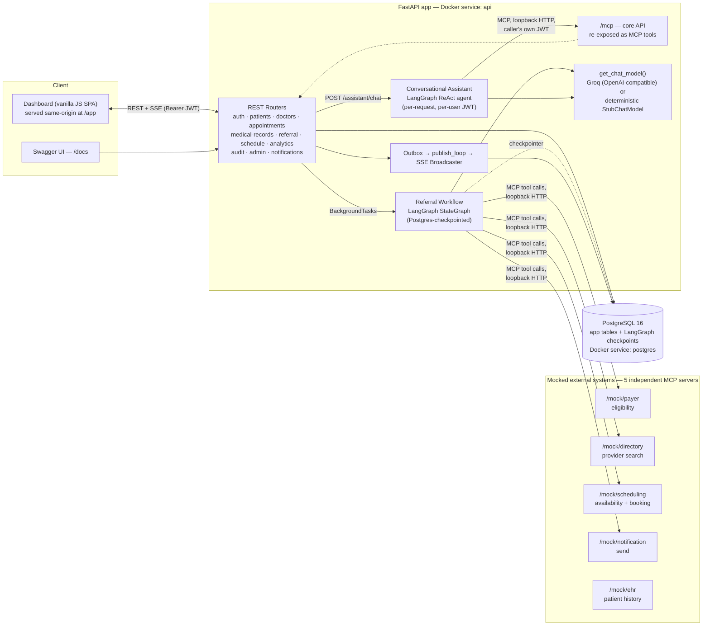
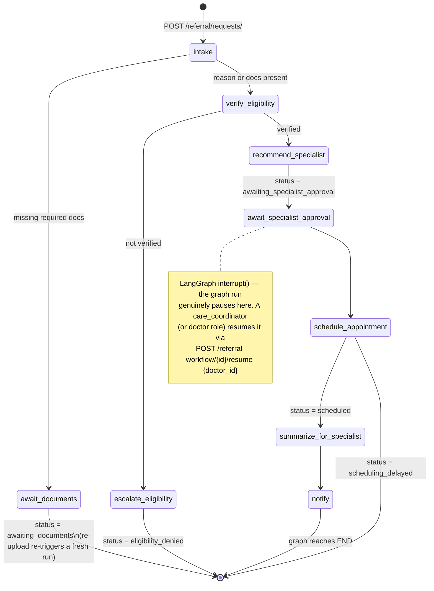
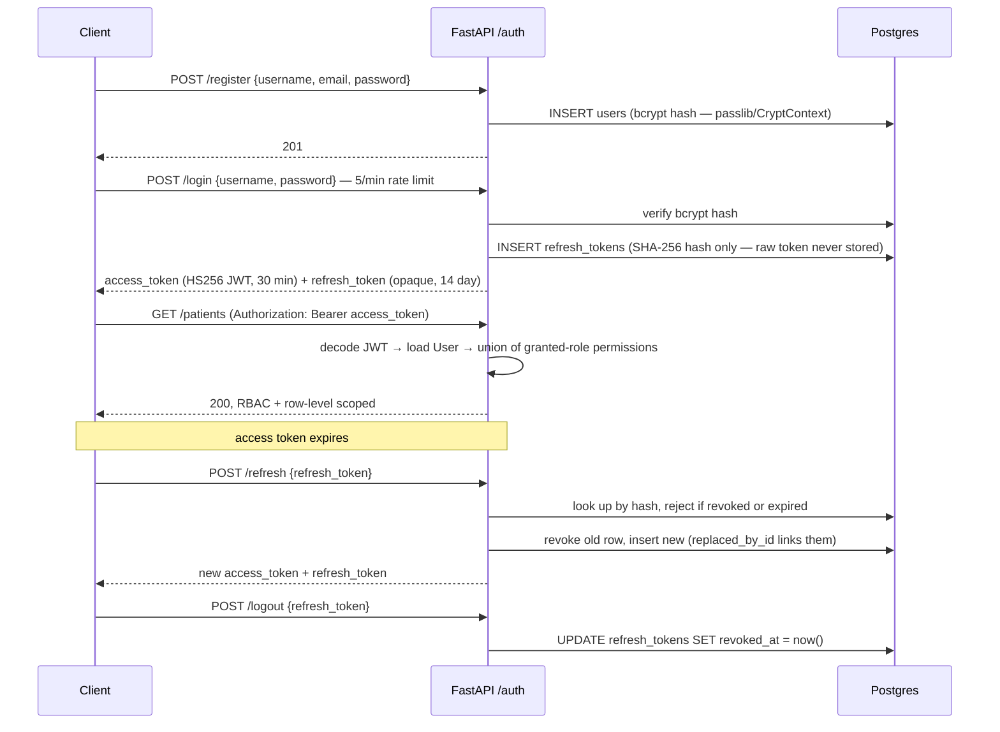
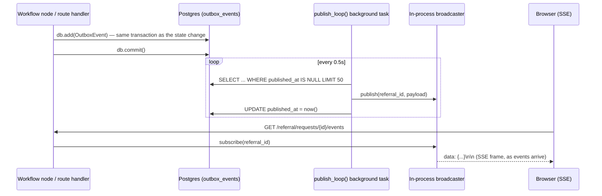

# Intelligent Care Coordination & Referral Management Platform

An end-to-end, AI-agentic referral management platform built for the Architect Academy capstone
problem statement (`problem_statemnet.txt`): patients referred by primary care providers to
specialists face delays from disconnected systems, incomplete clinical information, manual
insurance checks, and inefficient scheduling. This platform orchestrates the entire referral
journey — submission, document intake, eligibility verification, specialist recommendation,
human-approved scheduling, and post-consult follow-up — across patients, PCPs, specialists,
payers, and care coordinators, with a multi-agent **LangChain/LangGraph** workflow, **Model
Context Protocol (MCP)** integrations to (mocked) external systems, real-time status visibility,
and a full role-based web dashboard.

This README documents the system **as actually built and verified**, not just as planned — every
section below reflects the real code, confirmed by reading it end-to-end and by running the test
suite and a live Docker deployment.

---

## Table of Contents

1. [What This Project Demonstrates](#what-this-project-demonstrates)
2. [System Architecture](#system-architecture)
3. [Roles, Permissions & the Identity Model](#roles-permissions--the-identity-model)
4. [The Referral Lifecycle](#the-referral-lifecycle)
5. [AI / Agent Layer — LangChain, LangGraph & MCP](#ai--agent-layer--langchain-langgraph--mcp)
6. [API Reference](#api-reference)
7. [Data Model](#data-model)
8. [Auth, JWT & Security](#auth-jwt--security)
9. [Rate Limiting](#rate-limiting)
10. [Structured Logging & Correlation IDs](#structured-logging--correlation-ids)
11. [Middleware](#middleware)
12. [Event-Driven Architecture — Outbox & Real-Time SSE](#event-driven-architecture--outbox--real-time-sse)
13. [Services Layer](#services-layer)
14. [Frontend Dashboard](#frontend-dashboard)
15. [Project Structure](#project-structure)
16. [Getting Started (Local Dev)](#getting-started-local-dev)
17. [Docker Deployment](#docker-deployment)
18. [Testing](#testing)
19. [Known Limitations](#known-limitations)
20. [Further Reading](#further-reading)

---

## What This Project Demonstrates

Built across this capstone, the platform is a working demonstration of:

| Area | What was learned / applied |
|---|---|
| **Async API design** | FastAPI with async SQLAlchemy 2.0 + asyncpg, dependency-injected auth/DB sessions, background tasks, streaming (SSE) responses |
| **Multi-agent AI orchestration** | LangGraph `StateGraph` for a durable, resumable clinical workflow; a separate LangGraph ReAct agent for a conversational assistant |
| **Model Context Protocol (MCP)** | The core API *and* 5 mocked external systems each exposed as independent MCP servers; agents call them as scoped, audited tools |
| **Human-in-the-loop AI** | A real LangGraph `interrupt()` pauses the workflow for a care coordinator's specialist approval before resuming |
| **LLM integration with graceful degradation** | Every LLM-touching step has a deterministic rule-based/template fallback — the platform is 100% functional with zero API keys configured |
| **Authentication & security** | JWT access tokens + rotating refresh tokens with reuse detection, bcrypt password hashing, rate limiting |
| **Authorization** | Real RBAC: `Role`↔`Permission` tables plus row-level visibility filters (not just route-level gates) |
| **Event-driven architecture** | Transactional outbox pattern feeding an in-process pub/sub, surfaced to clients as Server-Sent Events |
| **Observability** | Structured JSON logging with request correlation IDs threaded through the whole call stack, including agent tool calls |
| **Data modeling & migrations** | 17 SQLAlchemy models, 7 linear Alembic migrations, soft deletes, many-to-many RBAC tables |
| **Testing** | 83 async tests (`pytest` + `httpx.ASGITransport`) covering RBAC, workflow orchestration, IDOR regressions, and the AI opportunities |
| **Containerized deployment** | Multi-stage-free `uv`-based Dockerfile, Docker Compose with health-checked service startup, verified fresh-checkout reproducibility |
| **Frontend engineering without a framework** | A dependency-free, hash-routed, RBAC-aware vanilla-JS SPA talking to the same REST API |

The **4 AI Opportunities** implemented (of the 7 listed in the problem statement, exceeding the
"any 4" requirement — 5 are fully built):

| # | AI Opportunity | Where |
|---|---|---|
| 1 | Extract diagnosis/procedure codes from uploaded documents | `intake_node` — LLM structured extraction + regex fallback |
| 2 | Recommend specialists by diagnosis/location/network | `specialist_node` — LLM ranking + weighted rule-based fallback |
| 3 | Summarize referral history for specialists | `summarizer_node` — LLM summary + template fallback |
| 4 | Identify missing documents before submission | `intake_node::infer_document_types` |
| 5 | Conversational assistant for patient/staff queries | `assistant_graph.py` — role-scoped ReAct agent + FAQ fallback |

---

## System Architecture

Everything runs as **one FastAPI process** (a deliberate "modular monolith" decision — the
problem statement asks for a microservices *design*, but grading happens via `docker compose up`
on a capstone timeline; module boundaries already only talk to each other through router/schema
interfaces, so splitting into real services later is a refactor, not a rewrite). The 5 mocked
external systems are separate FastAPI apps with their own MCP servers, mounted into the same
process for simplicity — each is still a genuinely independent tool namespace with its own
in-memory dataset.



**Architecture decisions** (full rationale in `CAPSTONE_IMPLEMENTATION_GUIDE.md`'s ADR-001 to
ADR-006):

- **Orchestration, not choreography, for the clinical workflow** — a single LangGraph
  `StateGraph` owns the referral's sequence/retries/pause points (predictability matters for a
  clinical process); a light choreographed layer (the outbox → SSE pipeline) handles status
  fan-out to watchers, so the workflow itself never has to know who's listening.
- **Three communication styles for three problems** — REST for synchronous client/API reads and
  writes, an internal transactional outbox for cross-cutting side effects (notifications,
  analytics, live status), and MCP specifically for agent ↔ external-system integration.
- **Stateless API layer** — no in-process session state; all workflow/conversation state lives in
  Postgres via LangGraph's `AsyncPostgresSaver`, keyed by `thread_id`. A pause survives an API
  restart — verified by resuming a human-in-the-loop approval after a fresh container start.
- **LLM behind one factory function with a deterministic fallback** — `get_chat_model()` is the
  only place an LLM client is constructed; every node that calls it has a rule-based/template
  fallback if no key is configured *or* if the live call fails, so a Groq outage degrades
  gracefully instead of 500ing.

---

## Roles, Permissions & the Identity Model

A login (`users`) and a clinical record (`patients`/`doctors`) are **two different rows in two
different tables**, joined by an optional foreign key. `POST /auth/register` creates a bare login
with no role and no clinical identity — an admin must separately (1) grant a role and (2) link the
account to a `Patient` or `Doctor` row before that account's "my own data" views resolve to
anything.

```
 users (login)                 patients / doctors (clinical record)
 ┌───────────┐   user_id FK    ┌───────────────────────┐
 │ id        │◄────────────────│ id                    │
 │ username  │  (nullable,     │ first_name/last_name  │
 │ password  │   1:1)          │ DOB, insurance, ...    │
 └─────┬─────┘                 └───────────────────────┘
       │ user_roles (M:N)
       ▼
     roles ──role_permissions (M:N)──► permissions
```

Seven roles, defined and idempotently re-synced on every startup in `app/core/seed.py`:

| Permission | patient | pcp | specialist | care_coordinator | payer_admin | doctor | admin |
|---|:---:|:---:|:---:|:---:|:---:|:---:|:---:|
| `referral:create` | ✅ | ✅ | | | | | ✅* |
| `referral:view_own` | ✅ | ✅ | ✅ | | | ✅ | ✅* |
| `referral:view_all` | | | | ✅ | ✅ | ✅ | ✅* |
| `referral:approve` | | | | ✅ | | ✅ | ✅* |
| `referral:override` | | | | ✅ | | | ✅* |
| `referral:record_outcome` | | | | ✅ | | ✅ | ✅* |
| `patient:view_own` | ✅ | | | | | | ✅* |
| `patient:view_all` / `manage` | | ✅ | ✅ | ✅ | | ✅ | ✅* |
| `doctor:manage` | | ✅ | ✅ | ✅ | | | ✅* |
| `appointment:view_own` | ✅ | ✅ | ✅ | | | ✅ | ✅* |
| `appointment:view_all` / `manage` | | ✅ | ✅ | ✅ | | ✅ | ✅* |
| `medical_record:view_own` | ✅ | ✅ | ✅ | | | ✅ | ✅* |
| `medical_record:view_all` | | | | ✅ | | ✅ | ✅* |
| `medical_record:manage` | | ✅ | ✅ | | | ✅ | ✅* |
| `analytics:view` | | | | ✅ | ✅ | | ✅* |
| `audit:view` | | | | | | | ✅* |
| `admin:*` | | | | | | | ✅ |

\* `admin:*` is a single bypass checked first everywhere — the `admin` role doesn't hold the
individual permissions, it short-circuits every check.

**Two design points worth knowing:**
- `patient:view_all` is deliberately broad — every clinical/coordination role can look up *any*
  patient, because this platform has no patient-panel/assignment model (a walk-in or cross-coverage
  provider legitimately needs a chart that isn't "theirs" yet).
- `appointment`/`medical_record` visibility stays need-to-know even for clinical roles —
  `view_own` means "encounters I'm actually the assigned doctor on," treating clinical notes as
  more sensitive than basic demographics.

**Role summaries:**

| Role | What they do |
|---|---|
| **patient** | Submits referrals for themselves, watches their own referral's live status, sees their own appointments/records — including the post-consult summary and referral documents, once a referral is completed |
| **pcp** | Refers patients to specialists (the platform's core entry point), manages patient/doctor directory records, treats patients directly |
| **specialist** | Receives referrals, manages patient/doctor/appointment/medical-record data — no `referral:create` |
| **care_coordinator** | The operational hub — sees every referral platform-wide, is the human-in-the-loop approver for specialist selection, records consult outcomes, views analytics |
| **payer_admin** | Read-only, platform-wide referral visibility + analytics — no clinical data access at all |
| **doctor** | A POC stand-in for "a specialist who can actually log in" — since AI-recommended specialists come from a mock directory's synthetic ID space with no real platform login, this role can pick up and complete *any* referral |
| **admin** | Full reach, plus the only role that can grant roles, link accounts to clinical records, and reset passwords |

Full per-role walkthroughs, every page's data points, and the two RBAC visibility mechanisms
(`referral_scope.py`, `record_scope.py`) are documented in detail in **`WORKFLOW.md`**.

---

## The Referral Lifecycle

The core cross-role saga is a LangGraph `StateGraph` (`app/agents/graph.py`), persisted to
Postgres via `AsyncPostgresSaver`, keyed by `thread_id = "referral-{referral_id}"` — durable across
restarts, pausable for a human decision mid-flight.



| Step | Node | Actor | Produces |
|---|---|---|---|
| 1 | *(route entry)* | Patient or PCP | `ReferralRequest` row, `status=submitted` |
| 2 | `intake_node` | system | ICD-10/procedure codes (LLM or regex), missing-document check |
| 3 | `eligibility_node` | system, via mock payer | verified/network status, copay estimate, prior-auth flag |
| 3a | `escalate_eligibility_node` | system | audit entry + `eligibility_denied` (run ends) |
| 4 | `specialist_node` | system, via mock provider directory | ranked specialist candidates (LLM or weighted rule-based score) |
| 5 | `await_specialist_approval` | **Care Coordinator** (human-in-the-loop) | selected doctor id — unpauses the interrupt |
| 6 | `scheduling_node` | system, via mock scheduling | booked appointment, or `scheduling_delayed` if no slot |
| 7 | `summarizer_node` | system | a `SpecialistNote` — whole-history pre-consult summary (LLM or template) |
| 8 | `notify_node` | system, via mock notification | patient-facing confirmation + in-app notification |
| 9 | *(outside the graph)* | **Care Coordinator** — `POST /requests/{id}/outcome` | `ReferralOutcome` + an async-generated whole-care-journey summary, referral `completed` |

Every transition writes a durable `OutboxEvent`, which both drives the live SSE stream on the
referral detail page and backs a human-readable `GET /requests/{id}/timeline`. Once a referral is
completed, its outcome (symptoms/diagnosis/prescription/summary) is visible to everyone who could
already see the referral — including the patient — and is also filed as a real `MedicalRecord` so
it shows up on the patient's own chart for the next visit.

---

## AI / Agent Layer — LangChain, LangGraph & MCP

### LLM configuration and the fallback pattern

`app/agents/llm.py::get_chat_model(task)` is the single seam that constructs an LLM client:

```python
def get_chat_model(task: str):
    if settings.llm_enabled and settings.llmgw_api_key:
        return ChatOpenAI(
            model=settings.llm_model, api_key=settings.llmgw_api_key,
            base_url=settings.llm_base_url, temperature=0,
            timeout=settings.llm_timeout_seconds, max_retries=settings.llm_max_retries,
        )
    return StubChatModel(task)
```

- **Provider**: Groq, via its OpenAI-compatible endpoint (`langchain_openai.ChatOpenAI` against
  `https://api.groq.com/openai/v1`, model `openai/gpt-oss-120b` by default) — a token-cheap,
  fast-inference choice for a project graded on functional correctness, not model quality.
- **`StubChatModel`** is a pure marker whose `.invoke()` deliberately raises — every node instead
  checks `isinstance(llm, StubChatModel)` and branches to its own hand-written deterministic logic
  (regex code extraction, weighted candidate scoring, template summaries, keyword-matched FAQ).
  Every real-LLM call site is *also* wrapped in a `try/except` that falls back to the same
  deterministic path on any runtime failure — a timeout or malformed response degrades the
  feature, it never 500s the request.
- This means **the platform is fully functional end-to-end with zero API keys configured** — the
  whole referral workflow, specialist ranking, summarization, and the assistant's FAQ mode all
  work offline. Add `LLMGW_API_KEY` to `.env` and every one of those steps upgrades to real
  LLM reasoning with no code change.

### Model Context Protocol (MCP)

Two layers of MCP servers exist in this system, both via `fastapi_mcp.FastApiMCP`:

1. **The core API itself** is mounted as an MCP server at `/mcp` (`app/main.py`, mounted *last* so
   every router's `operation_id` is finalized first — that `operation_id` becomes the MCP tool
   name). The conversational assistant calls back into this over real loopback HTTP with the
   *calling user's own JWT*, so a tool call is exactly as scoped as a browser request from that
   same user would be.
2. **5 mocked external systems**, each its own `FastAPI()` instance with its own `FastApiMCP`
   mount — genuinely separate tool namespaces and in-memory datasets, just co-hosted in one
   container for capstone simplicity:

   | Mock system | Mount | Simulates | MCP tool |
   |---|---|---|---|
   | `ehr_mock` | `/mock/ehr` | External EHR patient history lookup | `get_patient_history` *(mounted, not yet wired into any workflow node)* |
   | `payer_mock` | `/mock/payer` | Insurance eligibility verification (4 seeded plans) | `check_eligibility` |
   | `provider_directory_mock` | `/mock/directory` | Specialist directory search (6 seeded providers, 3 specialties) | `search_providers` |
   | `scheduling_mock` | `/mock/scheduling` | External scheduling system | `get_availability`, `book_slot` |
   | `notification_mock` | `/mock/notification` | Email/SMS/push delivery | `send_notification` |

   Every workflow node's MCP call goes through `app/agents/audit.py::call_tool_audited` — a
   governance wrapper that redacts sensitive args (policy numbers, SSNs) before logging, retries
   transient failures with exponential backoff, and writes an audit-log entry for every tool
   invocation.

### The conversational assistant

`POST /assistant/chat` builds a fresh LangGraph ReAct agent **per request** (never cached), so its
MCP client always carries that request's own bearer token:

- Resolves the caller's most-privileged role (`care_coordinator > doctor > specialist > pcp >
  patient`) and loads a **role-specific system prompt** plus a **role-specific tool allowlist**.
- Every role gets read-only referral tools (`get_referral`, `list_referrals`,
  `list_referral_documents`, `list_specialist_notes`); `care_coordinator` additionally gets
  workflow-state, scheduling, timeline, and analytics tools.
- Deliberately **never** exposes `get_patient`/`get_doctor`/`get_appointment`/`get_medical_record`
  as tools, because those REST routes (unlike referral routes) have coarser ownership scoping —
  handing an LLM a tool that can fetch any patient by ID would defeat the point of scoping tool
  calls to the caller's own JWT in the first place.
- With no LLM configured, every role falls back to the same deterministic keyword-matched FAQ
  responder — no tool calls, no patient data touched, role-agnostic by construction.

---

## API Reference

Every route in this table requires a bearer token (`get_current_active_user`) unless marked
**public**. "Scoped" means the response is additionally filtered by a row-level visibility filter,
not just a permission gate. Full request/response schemas are live at `/docs`.

<details>
<summary><strong>auth</strong> — <code>/auth</code></summary>

| Method & Path | Auth | Purpose |
|---|---|---|
| POST `/register` | public | Create a user account |
| POST `/login` | public, **5/min rate-limited** | Password login → access + refresh token pair |
| POST `/refresh` | public | Rotate refresh token → new pair; detects reuse of a revoked token |
| GET `/me` | any | Caller's id/username/email/roles/**effective permissions** |
| POST `/logout` | public (takes the token in body) | Revoke a refresh token |

</details>

<details>
<summary><strong>patients</strong> — <code>/patients</code></summary>

| Method & Path | Permission | Purpose |
|---|---|---|
| POST `/` | `patient:manage` | Create (auto-assigns a demo insurance policy if none given) |
| GET `/` | scoped | List, paginated |
| GET `/{id}` | scoped | Get one |
| GET `/{id}/context` | scoped | **Unified view**: appointments, medical records, referrals, referral documents, insurance, derived care team — one call replacing four |
| PUT `/{id}` | `patient:manage` | Update |
| DELETE `/{id}` | `patient:manage` | Soft-delete |

</details>

<details>
<summary><strong>doctors</strong> — <code>/doctors</code></summary>

| Method & Path | Permission | Purpose |
|---|---|---|
| POST / PUT / DELETE `/` | `doctor:manage` | Create / update / soft-delete |
| GET `/`, `/{id}` | any | Directory browse — not PHI, open reads |

</details>

<details>
<summary><strong>appointments</strong> — <code>/appointments</code></summary>

| Method & Path | Permission | Purpose |
|---|---|---|
| POST `/` | `appointment:manage` | Create |
| GET `/`, `/{id}` | scoped | List / get |
| PUT `/{id}` | `appointment:manage` **or** limited patient self-service (reschedule/cancel own) | Update |
| DELETE `/{id}` | `appointment:manage` | Soft-delete |

</details>

<details>
<summary><strong>medical-records</strong> — <code>/medical-records</code></summary>

| Method & Path | Permission | Purpose |
|---|---|---|
| POST `/` | `medical_record:manage` | Create |
| GET `/`, `/{id}` | scoped | List (optional `patient_id` filter) / get |
| PUT `/{id}` | `medical_record:manage` | Update |
| DELETE `/{id}` | `medical_record:manage` | Soft-delete |

</details>

<details>
<summary><strong>referral</strong> — <code>/referral</code> (the core domain)</summary>

| Method & Path | Permission | Purpose |
|---|---|---|
| POST `/requests/` | `referral:create` | Submit (202) — kicks off the LangGraph workflow as a background task |
| GET `/requests/`, `/requests/{id}` | scoped | List (filterable by status) / get |
| PATCH / DELETE `/requests/{id}` | `referral:approve` \| `referral:override` \| `admin:*` | Edit / soft-delete |
| POST `/requests/{id}/documents` | scoped | Upload a document (202) — re-triggers the workflow if still early |
| GET `/requests/{id}/documents` | scoped | List uploaded documents + extraction results |
| GET `/requests/{id}/notes` | scoped | AI/manual specialist notes |
| GET `/requests/{id}/timeline` | scoped | Human-labeled milestone history, read from the outbox |
| POST `/requests/{id}/outcome` | `referral:record_outcome` | Record consult outcome (202) — completes the referral, triggers the async summary |
| GET `/requests/{id}/outcome` | scoped (same visibility as the referral itself) | Read the recorded outcome |
| GET `/requests/{id}/events` | scoped | **SSE stream** of live status events |

</details>

<details>
<summary><strong>referral-workflow (AI)</strong> — <code>/referral-workflow</code></summary>

| Method & Path | Permission | Purpose |
|---|---|---|
| GET `/{id}/state` | scoped | LangGraph-only state: specialist candidates, eligibility result, extracted codes |
| POST `/{id}/resume` | `referral:approve` | Resume a paused interrupt with `{doctor_id}` — 409 if nothing is pending |

</details>

<details>
<summary><strong>assistant (AI)</strong> — <code>/assistant</code></summary>

| Method & Path | Permission | Purpose |
|---|---|---|
| POST `/chat` | any | `{message, session_id}` → role-scoped agent reply, or FAQ fallback with no LLM configured |

</details>

<details>
<summary><strong>schedule</strong> — <code>/schedule</code></summary>

| Method & Path | Permission | Purpose |
|---|---|---|
| POST `/availability/` | `appointment:manage` | Create a doctor's recurring weekly window |
| GET `/availability/` | any | List |
| POST `/slots/generate` | `appointment:manage` | Materialize concrete bookable slots (idempotent) |
| GET `/slots/` | any | List (filterable by doctor / booked status) |
| POST `/slots/{id}/book` | any | Book → creates an `Appointment`, marks the slot booked |

</details>

<details>
<summary><strong>analytics, audit, admin, notifications, health</strong></summary>

| Method & Path | Permission | Purpose |
|---|---|---|
| GET `/analytics/referrals/summary` | `analytics:view` | Status funnel, avg time-to-schedule, delay-risk count, top specialties, denial rate |
| GET `/audit/` | `audit:view` | Paginated audit log (admin-only) |
| GET `/admin/roles`, `/admin/users` | `admin:*` | List roles / users with roles |
| POST/DELETE `/admin/users/{id}/roles[/...]` | `admin:*` | Grant / revoke a role |
| POST `/admin/users/{id}/reset-password` | `admin:*` | Reset password, revoke that user's active refresh tokens |
| POST `/admin/users/{id}/link-patient/{pid}`, `/link-doctor/{did}` | `admin:*` | Link a login to a clinical record — the mechanism that makes `*:view_own` resolve to anything |
| GET `/notifications/`, POST `/notifications/{id}/read` | any (self-scoped) | The in-app notification inbox |
| GET `/health/live`, `/health/ready` | public | Liveness / readiness (readiness pings the DB) |

</details>

---

## Data Model

17 SQLAlchemy models across 12 files, backed by 7 linear Alembic migrations.

| Domain | Models |
|---|---|
| **Identity & RBAC** | `User`, `Role`, `Permission`, `UserRole`, `RolePermission`, `RefreshToken` |
| **Clinical directory** | `Patient`, `Doctor` (both soft-deletable, both optionally linked to a `User` via nullable `user_id`) |
| **Encounters** | `Appointment`, `MedicalRecord` (soft-deletable, need-to-know visibility) |
| **Referral domain** | `ReferralRequest`, `ReferralDocument`, `SpecialistNote`, `ReferralOutcome` |
| **Scheduling** | `DoctorAvailability` (recurring template), `ScheduleSlot` (materialized bookable instance) |
| **Cross-cutting** | `Notification`, `AuditLog`, `OutboxEvent` |
| **Insurance (seeded, read by the mock payer only)** | `InsurancePlan`, `DoctorInsuranceNetwork` |

Every "list-of-things" table (Patient, Doctor, Appointment, MedicalRecord, ReferralRequest,
DoctorAvailability, ScheduleSlot) mixes in `SoftDeleteMixin` — deletes set `deleted_at` rather than
removing the row, preserving history for audit.

```
users ──user_roles──> roles ──role_permissions──> permissions
  │
  ├─(user_id, nullable 1:1)── patients ──┬── appointments
  │                                       └── medical_records
  └─(user_id, nullable 1:1)── doctors ────┴── (same two, other side)

referral_requests ──┬── referral_documents
                     ├── specialist_notes
                     └── referral_outcomes (1:1)

doctor_availability ──> schedule_slots ──> appointments
```

---

## Auth, JWT & Security



- **Access tokens**: `python-jose`, HS256, `sub=username`, 30-minute default expiry
  (`app/auth/jwt_handler.py`). Fully stateless — no per-request DB check beyond looking the user up
  by username.
- **Refresh tokens**: opaque `secrets.token_urlsafe(48)`, **only their SHA-256 hash is persisted**
  (`app/auth/refresh_tokens.py`). Every `/auth/refresh` call **rotates** the token — the old row is
  revoked and linked to the new one via `replaced_by_id`. If an already-revoked (rotated-out) token
  is presented again, that's logged as `auth.refresh_token_reuse_detected` and rejected — a signal
  of a possibly stolen token, not just an expired one.
- **Passwords**: bcrypt via `passlib.CryptContext` — one-way by construction; an admin password
  reset sets a new hash and revokes all of that user's active refresh tokens, so an old session
  can't outlive a credential reset.
- **RBAC enforcement, two layers**:
  1. `require_permission(name)` — a FastAPI dependency factory that loads the user's roles
     (eager-joined with permissions) and 403s unless the named permission or `admin:*` is granted.
  2. **Row-level visibility filters** (`app/services/record_scope.py`,
     `referral_scope.py`) — `*_visibility_filter()` functions return either `None` (unrestricted,
     for `*:view_all`/`admin:*`) or a SQLAlchemy `WHERE` clause scoping the query to rows the
     caller's linked `Patient`/`Doctor` is actually party to. A caller with only `*:view_own` and
     **no linked record** sees nothing (`sql.false()`), not everything — fail-closed by
     construction, verified by a dedicated IDOR regression test suite (`tests/test_record_scope.py`).
- **Audit trail**: every register/login/login-failure/refresh/reuse-detection/logout event, plus
  every referral mutation and MCP tool call, is written to `audit_logs` via `log_action()` — riding
  inside the same DB transaction as the action itself, so an audit entry never exists for a write
  that didn't happen (and never goes missing for one that did).

---

## Rate Limiting

`slowapi.Limiter(key_func=get_remote_address)` — IP-based. Currently applied to **`POST
/auth/login` at 5 requests/minute**, the credential-stuffing/brute-force choke point; registered
globally in `app/main.py` via `app.state.limiter` + a `RateLimitExceeded` exception handler.

---

## Structured Logging & Correlation IDs

Every log line is a single JSON object (`app/core/logging.py::JsonFormatter`):
`{ts, level, logger, correlation_id, message, [exc_info]}`, written to stdout — container-native,
no file handles to manage.

The `correlation_id` is not per-process — it's per-**request**, propagated via a
`contextvars.ContextVar` set by `CorrelationIdMiddleware`:

1. Reads `X-Correlation-Id` from the incoming request, or mints a new `uuid4().hex`.
2. Sets it into the context var for the lifetime of that request/response cycle.
3. Echoes it back as the `X-Correlation-Id` response header.

Because it's a context var (not a function argument threaded everywhere by hand), **every log
line emitted anywhere during that request** — including deep inside an agent node's MCP tool call
— carries the same correlation ID, making a single request traceable end-to-end across the REST
layer, the LangGraph workflow, and the mocked external systems it calls.

---

## Middleware

| Middleware | What it does |
|---|---|
| `CorrelationIdMiddleware` | Request-scoped correlation ID (above) |
| `CORSMiddleware` (via `add_cors_middleware`) | Allow-listed origins from `settings.backend_cors_origins`, credentials allowed |
| `NoCacheDashboardMiddleware` | Forces `Cache-Control: no-store` on every response under `/app` — the hand-edited, no-build-step dashboard never gets stuck behind browser heuristic caching during iteration |

---

## Event-Driven Architecture — Outbox & Real-Time SSE

Satisfies the "real-time referral status updates through conversational interfaces" hint and the
"real-time status tracking" evaluation focus area, without needing a message broker.



- **Write side (transactional outbox)**: `write_outbox_event()` just does `db.add(OutboxEvent(...))`
  — no separate commit — so it always rides inside the exact same transaction as the state change
  it describes. No dual-write problem, no lost events.
- **`outbox_events` is append-only and permanent** — rows are marked `published_at`, never deleted,
  so besides driving live updates it doubles as a durable, replayable milestone history (read back
  by `GET /requests/{id}/timeline`).
- **`publish_loop()`** runs as an `asyncio.Task` for the life of the process (started in `main.py`'s
  lifespan alongside opening the LangGraph checkpointer): polls for unpublished rows every 0.5s,
  hands each to an in-process pub/sub `broadcaster`, marks it published.
- **`broadcaster`** is an in-memory `{referral_id: [asyncio.Queue, ...]}` — a deliberate stand-in
  for Redis pub/sub (this capstone runs single-process); swapping its `publish`/`subscribe`
  internals for Redis is the only change needed to scale beyond one replica.
- **Client side**: native `EventSource` can't carry an `Authorization` header, so the dashboard
  reads the stream via a manual `fetch` + `ReadableStream` (`static/js/api.js::streamReferralEvents`)
  with its own exponential-backoff reconnect — this is how a patient watching their referral detail
  page sees it move from `submitted` to `scheduled` with no manual refresh.

---

## Services Layer

| Service | Responsibility |
|---|---|
| `patient_context.py` | Assembles the unified "everything about this patient" view by re-running each resource's own visibility filter — never broader than what the caller could already see by hand across 4 separate endpoints |
| `record_scope.py` / `referral_scope.py` | The row-level RBAC filter builders described above |
| `referral_outcome.py` | Generates the async whole-care-journey completion summary and files it as a real `MedicalRecord` |
| `referral_workflow.py` | Kicks off the LangGraph workflow as a background task, keyed by `thread_id` |
| `notifications.py` | In-app notification inbox (distinct from the mocked *external* notification MCP tool) |
| `audit.py` | `log_action()` — the audit-log write helper used everywhere |
| `insurance.py` | Weighted random demo-policy assignment so a new patient always has something real to check eligibility against |
| `storage.py` | Local-disk referral document storage — one function, explicitly swappable for S3 |

---

## Frontend Dashboard

A dependency-free vanilla-JS SPA (`static/`, served same-origin at `/app` — no CORS needed, no
build step) with hash-based client-side routing (`#/referrals/12`), so deep links never need a
matching server route.

- **`state.js`** — the single source of truth for tokens and `/auth/me`'s permission set; every
  UI gate (`hasPermission()`) trusts the server's permission list verbatim rather than re-deriving
  it from role names.
- **`api.js`** — a thin `fetch` wrapper with automatic access-token refresh-and-retry on a 401, plus
  the manual SSE reader described above.
- **`router.js`** — a ~60-line hash router (pattern compiling, param extraction, not-found
  fallback) — no framework.
- **`resource.js`** — one generic CRUD-table+modal factory reused by Patients/Doctors/Appointments/
  Medical Records, configured per-resource rather than duplicated four times.
- Every nav item is conditionally rendered per the caller's real permissions, but — matching the
  backend's own philosophy — that's a UX convenience only; every route is re-checked server-side
  regardless of what the sidebar shows.
- Notable pages: a unified **Patient Detail** page (`#/patients/:id`) aggregating a patient's
  referrals, appointments, medical records, and referral documents in one read-only view; a
  **Referral Detail** page with Documents/Notes/Workflow-State/Timeline/Outcome tabs and a live
  SSE status indicator; an **Admin** panel for role-granting and account linking; and a role-scoped
  **Assistant** chat.

---

## Project Structure

```
app/
  agents/            LangGraph workflow + assistant graph, LLM factory, MCP client, checkpointer
    nodes/           intake · eligibility · specialist · scheduling · summarizer · notify
  api/
    routes/          REST routers (patients, doctors, referral, schedule, admin, ...)
      ai/            referral_workflow.py (human-in-the-loop), assistant.py (chat)
    dependencies/    auth, DB session, pagination
  auth/              JWT handling, refresh-token rotation, password hashing
  core/              settings, structured logging, rate limiting, RBAC seed data
  database/          async engine/session setup
  events/            outbox writer, publish loop, in-process SSE broadcaster
  middlewares/       correlation ID, CORS, no-cache-dashboard
  models/            SQLAlchemy models
  schemas/           Pydantic request/response models
  services/          business logic reused across routes (scope filters, context aggregation, ...)
alembic/versions/    7 linear migrations
mock_systems/        5 independent FastAPI+MCP apps simulating external systems
static/              vanilla-JS dashboard (no build step)
tests/                83 async tests
sample_documents/    seed documents for the auto-attach-sample-document demo path
scripts/             role granting, role/permission seeding, sample-data seeding, container entrypoint
Dockerfile, docker-compose.yml    containerized deployment (see below)
CAPSTONE_IMPLEMENTATION_GUIDE.md  phased build guide + architecture decision records (ADRs)
WORKFLOW.md                       exhaustive role-by-role, page-by-page data-flow reference
```

---

## Getting Started (Local Dev)

```bash
uv sync
cp .env.example .env   # fill in DATABASE_URL / SECRET_KEY; LLMGW_API_KEY optional
uv run alembic upgrade head
uv run python scripts/seed_roles.py
uv run uvicorn app.main:app --reload
```

On Windows, add `--loop app.core.event_loop:selector_event_loop_factory` — the LangGraph Postgres
checkpointer's driver (psycopg3, async mode) can't run under Windows' default `ProactorEventLoop`,
and uvicorn's built-in loop hardcodes Proactor on win32 regardless of `asyncio`'s event-loop
policy. Not needed on Linux/macOS, including the Docker deployment.

`/docs` for Swagger UI, `/mcp` for the core API's MCP tool interface, `/app` for the dashboard.

First-run bootstrap (no self-service admin signup, by design — see `WORKFLOW.md` §10):

```bash
uv run python scripts/grant_role.py <your_username> admin
```

Then use the Admin panel (or `POST /admin/users/{id}/roles` + `/link-patient`/`/link-doctor`) to
turn other registered accounts into working patient/pcp/specialist/coordinator logins.

---

## Docker Deployment

Satisfies the capstone's deployment requirement: *"Dockerized deployment with source code,
Dockerfile, README, and instructions to run the solution in a container; evaluation will be done
based on docker container execution."*

```bash
docker compose up --build
```

That's the whole thing — one command, two services, no manual setup steps.

**What's in it:**

- **`Dockerfile`** — single stage on `ghcr.io/astral-sh/uv:python3.11-bookworm-slim` (the same
  Python version and `uv`-managed dependency set as local dev). Dependencies are synced in their
  own layer, cached separately from source changes, so an app-code edit doesn't re-resolve the
  lockfile on every rebuild.
- **`docker-compose.yml`** — two services:
  - `postgres` (16), with a `pg_isready` healthcheck and a named volume for data.
  - `api`, which waits for Postgres to report healthy, mounts a named volume at `/app/uploads`
    (referral documents are local-disk storage — this volume is what makes them survive a
    container restart/rebuild), and exposes its own `/health/ready` as a Docker healthcheck.
  - `DATABASE_URL` is deliberately overridden in `environment:` (after `env_file: .env`) to point
    at the compose-managed `postgres` service — your local `.env`'s `DATABASE_URL` (pointing at
    `localhost`) is otherwise meaningless inside a container network.
- **`scripts/start.sh`** — the container entrypoint: `alembic upgrade head` → seed
  roles/permissions → `uvicorn app.main:app --host 0.0.0.0 --port 8000`. Both steps are idempotent,
  safe to run on every container start.
- No Redis, despite an earlier planning draft including one — the actual rate limiter
  (`slowapi`) is in-memory only, so a Redis service would have been unused weight.

**Verified, not just written**, this session: built the image, brought the stack up against a
brand-new Postgres volume, confirmed both services report `healthy`, ran a full HTTP-only
end-to-end smoke test through the container (register → grant roles → submit a referral → progress
it through the LangGraph workflow with a real LLM call → record an outcome → confirm the patient
can see their own outcome and referral documents → confirm an unrelated account gets a 404, not a
leak), then tore down with `docker compose down -v` and rebuilt from nothing to confirm the whole
thing is reproducible from a clean checkout, not just working because a volume was already warm.

**Environment variables** (`.env`, see `.env.example`):

| Variable | Required | Notes |
|---|---|---|
| `DATABASE_URL` | yes | Overridden by Compose to the internal `postgres` service — only matters for non-Docker local dev |
| `SECRET_KEY` | yes | JWT signing key — change this for anything beyond local/demo use |
| `LLM_ENABLED` | no (default `false`) | Master switch; the platform runs fully functional without it |
| `LLMGW_API_KEY` | no | Groq API key — added mid-project without changing any calling code, by design (ADR-005) |

---

## Testing

```bash
uv run pytest
```

83 async tests (`pytest-asyncio` + `httpx.ASGITransport` — no real socket needed, so LangGraph
background tasks run to completion deterministically inside a test, unlike a real server), covering:

- RBAC and row-level visibility scoping, including a dedicated IDOR regression suite
  (`test_record_scope.py`) proving a caller can't reach another patient's data by guessing IDs.
- The full referral workflow end to end, including the human-in-the-loop pause/resume cycle.
- Document upload + extraction, eligibility verification (verified/denied paths), specialist
  ranking, scheduling (including the no-slots-available path).
- The consult-outcome → completion-summary → patient-visible-medical-record chain.
- The event/outbox/timeline system and the notification inbox.
- Auth: registration, login, rate limiting, refresh rotation, reuse detection, logout.

Both a pure-SQLite in-memory run and a real-Postgres run (including inside the Docker container
itself) have been exercised this project — SQLite for fast iteration, Postgres to catch
driver/dialect differences (e.g., a strict `Date` vs. `timestamptz` bug that only surfaced against
real Postgres, fixed in migration `4dabbc27a591`).

---

## Known Limitations

Documented deliberately, not discovered by a grader — same practice as `WORKFLOW.md` §11 and the
implementation guide's Known-Gaps matrix:

- **Write-side ownership isn't enforced beyond the coarse `*:manage` permission** — e.g. a `pcp`
  can edit a patient they've never actually treated. Read-side visibility scoping is real and
  tested; write-side "is this actually yours to edit" is not, and is flagged as deferred hardening.
- **`/schedule/*` slot-booking is open to any authenticated user** — deliberately, so a patient's
  self-service "Book an Appointment" flow keeps working; slot/availability *creation* is gated
  behind `appointment:manage`.
- **AI-recommended specialists usually aren't real platform logins** — candidates come from the
  mock provider directory's synthetic ID space, which is why outcome-recording belongs to
  `care_coordinator`/`doctor`, not the `specialist` role directly.
- **The EHR mock (`/mock/ehr`) is mounted and MCP-reachable but not called by any workflow node** —
  a demonstrated integration pattern, not yet a wired-in data source.
- **`llm_max_tokens_*` settings exist but aren't currently passed into any LLM call** — harmless,
  flagged here for honesty rather than silently left inconsistent.

---

## Further Reading

- **`CAPSTONE_IMPLEMENTATION_GUIDE.md`** — the phased build guide, full Architecture Decision
  Records (ADR-001 through ADR-006), business capability map, and API specifications with sample
  requests/responses.
- **`WORKFLOW.md`** — an exhaustive role-by-role, page-by-page walkthrough of every data point and
  how it flows between roles, plus the Admin-panel linking mechanism in full detail.
- **`REBUILD_GUIDE.md`** — the FastAPI/JWT/SQLAlchemy fundamentals reference this capstone build
  extends.
